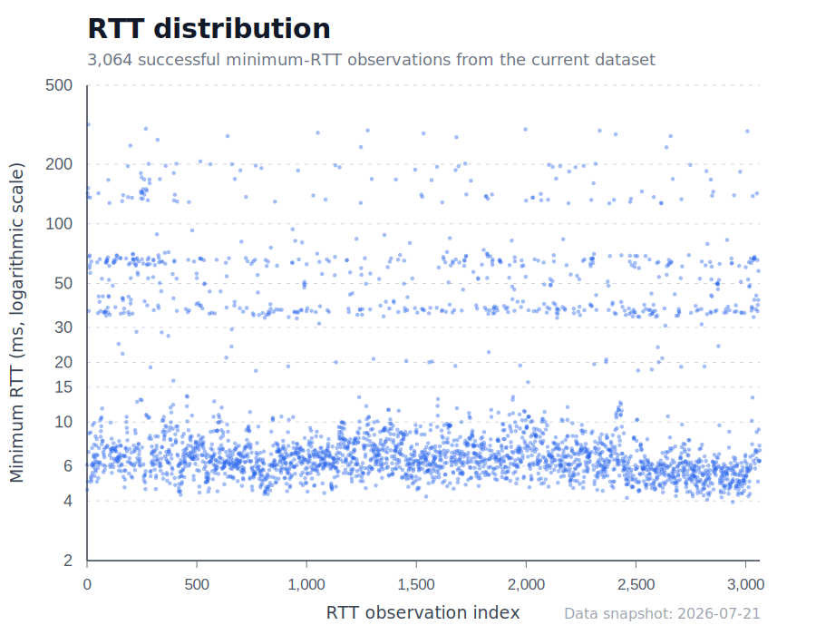

# RTT Threshold Configuration and Analysis

For Traditional Chinese documentation, see [`RTT.zh-TW.md`](RTT.zh-TW.md).

## Overview

This project uses **RTT (Round Trip Time)** as one of the auxiliary methods for determining whether a network resource is located within Taiwan. When location cannot be determined via HTTP headers (such as `cf-ray`, `x-amz-cf-pop`, `x-azure-ref`, `x-msedge-ref`, etc.) or the [LACeS Anycast Census API](LACeS.md), an RTT test is performed to infer the resource's geographic location.

## RTT Threshold Configuration

### Current Setting

**Threshold: 15 milliseconds (ms)**

Defined in: `no-global-connection-check.js`, line 63

```javascript
const RTT_THRESHOLD = 15;
```

### Detection Logic

The implementation logic in `no-global-connection-check.js` is as follows:

1. **Check HTTP headers first**: If a header indicates a Taiwan node (e.g. `cf-ray` contains `TPE`, `x-azure-ref` contains `TPE`, or `x-msedge-ref` has `Ref B: TPE...`), mark directly as `country: 'tw'`, `detection_method: 'header'`.

2. **If no header marker is found, query LACeS Anycast Census API**: If `has_tw` and `confidence` is reliable, mark as `country: 'tw'`, `detection_method: 'laces'`, with census data in `cloud_provider.laces`. See [`LACeS.md`](LACeS.md).

3. **If LACeS does not classify as domestic, run an RTT test**:
   - **RTT < 15ms**: Classified as within Taiwan
     - Set `cloud_provider.country = 'tw'`
     - Set `cloud_provider.detection_method = 'rtt'`
     - Record `cloud_provider.rtt` value
   
   - **RTT ≥ 15ms**: Not marked as domestic
     - Do not set `cloud_provider.country`
     - Set `cloud_provider.detection_method = 'rtt'`
     - Record `cloud_provider.rtt` value (for later analysis)
   
4. **If the RTT test fails**: Record failure details in `cloud_provider`; because no positive Taiwan-location evidence is available, the endpoint remains classified as `foreign/cloud`:
   - Set `cloud_provider.detection_method = 'rtt'`
   - Set `cloud_provider.rtt = null`
   - Set `cloud_provider.rtt_error` to a brief reason: `timeout`, `no_response`, `parse_error`, or `command_failed`

## Rationale for Using 15ms as the Threshold

RTT is the time required for a network packet to travel from the sender to the receiver and back. In the current dataset, 3,640 site–hostname observations reached the RTT fallback and 3,064 produced a numeric minimum RTT. Multiple requests to the same hostname within one site load are deduplicated; the same hostname on different sites is counted once for each site.

### Statistics

| Metric | Value |
|--------|-------|
| Mean | 20.837ms |
| Median | 6.867ms |
| p90 | 61.361ms |
| Maximum | 316.711ms |

| Minimum RTT range | Count | Share of measured RTTs |
|---:|---:|---:|
| 0–<5ms | 206 | 6.7% |
| 5–<10ms | 2,090 | 68.2% |
| 10–<15ms | 98 | 3.2% |
| 15–<20ms | 12 | 0.4% |
| 20–<30ms | 20 | 0.7% |
| 30–<50ms | 270 | 8.8% |
| 50–<100ms | 247 | 8.1% |
| 100–<200ms | 100 | 3.3% |
| ≥200ms | 21 | 0.7% |

### Analysis

The 10–30ms transition range contains 130 observations (4.2% of successful RTT measurements). We select the conservative criterion of `RTT < 15ms` within this relatively sparse interval, reducing the risk of treating a low-latency nearby foreign node as domestic.



A site-level sensitivity analysis shows that 2,147 of 2,179 sites (98.5%) retain the same classification across thresholds of 10, 15, and 20ms. Relative to 15ms, 27 sites (1.2%) change classification at 10ms and 5 sites (0.2%) change at 20ms.

## Potential Limitations

1. **Test environment dependency**: This value depends on the local network topology and may not apply outside Taiwan or other regions.
2. **Edge cases**: RTT alone is not geographic ground truth. The 130 observations in the 10–30ms transition range have greater classification uncertainty.

## Future Improvements

### 1. Collect RTT statistics for nodes with known geographic location to establish a more precise threshold

### 2. Tiered interpretation

For the hard-to-classify 10–30ms range, future versions could combine RTT with additional independent location evidence rather than treating latency as geographic ground truth.

## Related Tools and Files

### Analysis tools

1. **`export-rtt-csv.js`**
   - Purpose: Export every RTT fallback observation, including failures, to CSV
   - Usage: `node export-rtt-csv.js`
   - Output: `rtt.csv` with detailed RTT test information

### Data files

1. **`rtt.csv`**
   - Format: CSV with fields:
     - `file`: Source JSON filename
     - `site_url`: Tested website URL
     - `original_url`: Resource request URL with query strings and fragments removed
     - `domain`: ipinfo.domain
     - `ip`: ipinfo.ip
     - `ipinfo_country`: ipinfo.country
     - `cloud_country`: cloud_provider.country (if present, usually `tw`)
     - `category`: Final domain category at the configured threshold
     - `detection_method`: `rtt`
     - `rtt`: Actual RTT value in milliseconds; blank on failure
     - `rtt_error`: Failure reason when RTT fails (`timeout`, `no_response`, `parse_error`, `command_failed`)

2. **Generated RTT statistics**
   - `test-results/rtt-summary.tsv`: fallback coverage and outcome counts
   - `test-results/rtt-distribution.tsv`: measured RTT histogram
   - `test-results/rtt-threshold-sensitivity.tsv`: site classifications at 10, 15, and 20ms

3. **`test-results/*.json`**
   - Per-site test result JSON files
   - Contains `domainDetails` array; each element may include `cloud_provider.rtt`, `cloud_provider.laces`, `cloud_provider.detection_method`, and `cloud_provider.rtt_error` (on RTT failure)

### Related links

- [RTT test implementation](no-global-connection-check.js) (threshold at line 69, logic after header and LACeS steps)
- [LACeS integration](LACeS.md)
- [RTT data export tool](export-rtt-csv.js)
- [Full RTT data](rtt.csv)

---

*Last updated: 2026-07-22*
