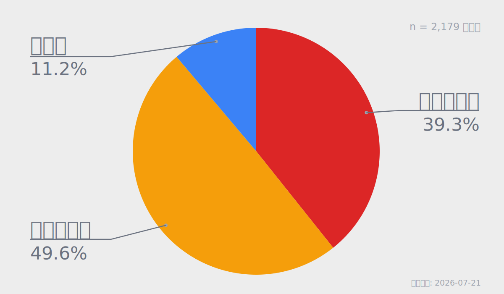
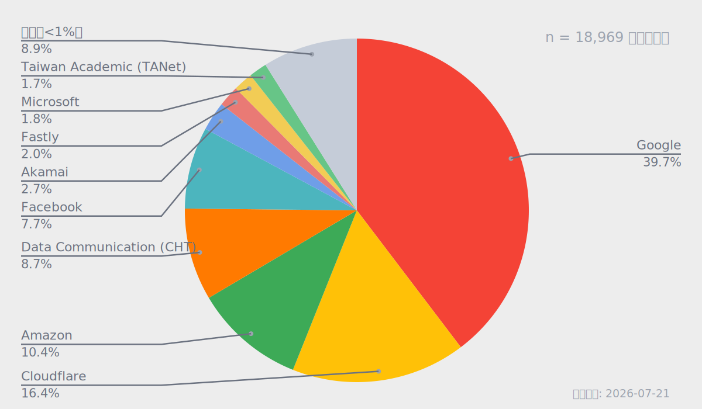
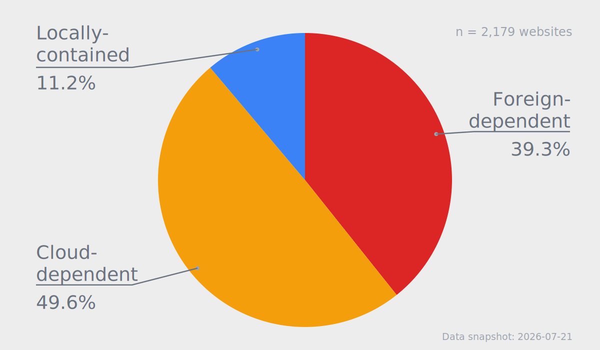
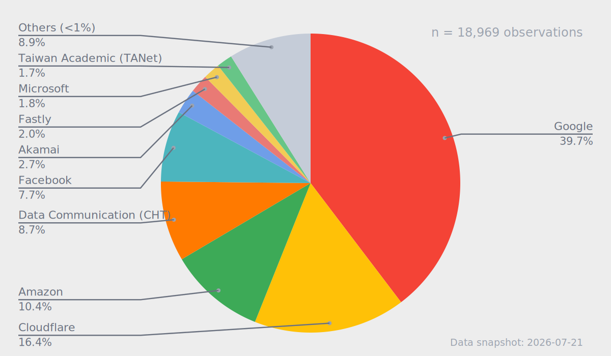

# 圖表中英雙語開發計畫

## 目標

自 2026-06-29 後，`generate_statistic.js` 產生的圖表文字改為英文，導致中文報告與中文 Profile 也顯示英文圖表。本計畫將圖表改為繁體中文與英文雙版本，並由報告、投影片與 Profile 依頁面語系引用正確圖檔。

本計畫只處理圖表語系、檔名、引用與發布輸出，不改變統計母體、統計公式、TSV schema 或分類結果。

## 現況

- `generate_statistic.js` 的整體結果分類名稱目前寫死為 `Immobile`、`Intl. cloud`、`Relocatable`。
- 資源分布圖的 `Others (<1%)`、`requests`、`Data snapshot` 目前寫死為英文。
- `report/index.md` 與 `report/en.md` 目前引用相同的無 suffix 圖檔。
- 英文投影片目前引用無 suffix 圖檔。
- Profile 中英文首頁目前都使用 `/web/img/overall-result.png`，OG 與 Twitter 圖片也使用同一檔案；localhost 與 prerender rewrite 同樣指向無 suffix 路徑。
- `report/chart-spec.md` 與 `report/chart-spec.zh-TW.md` 的檔名規格尚未包含語系 suffix；中文規格副標仍寫 `websites`。
- 圖表資料來源為既有的 `overall-result.tsv` 與 `resource-distribution.tsv`；不需要重新掃描 JSON 才能進行圖表本地化。

## 已確認的設計決策

### 1. 無 suffix 圖檔是繁中相容 alias

無 suffix 圖檔必須與 `.zh-TW` 版本 byte-for-byte 相同，以延續 2026-06-29 以前預設顯示中文圖表的行為。

```text
overall-result.svg
  = overall-result.zh-TW.svg

overall-result.png
  = overall-result.zh-TW.png

resource-distribution.svg
  = resource-distribution.zh-TW.svg
```

Dated charts 遵守相同規則：

```text
overall-result-YYYY-MM-DD.svg
  = overall-result-YYYY-MM-DD.zh-TW.svg

overall-result-YYYY-MM-DD.png
  = overall-result-YYYY-MM-DD.zh-TW.png

resource-distribution-YYYY-MM-DD.svg
  = resource-distribution-YYYY-MM-DD.zh-TW.svg
```

英文圖表一律使用明確的 `.en` suffix，不提供英文無 suffix alias。

### 2. Repo 內 consumer 明確指定語系

- 中文報告引用 `.zh-TW`。
- 英文報告引用 `.en`。
- 現有英文投影片引用 `.en`。
- 中文 Profile 引用 `.zh-TW`。
- 英文 Profile 引用 `.en`。
- 無 suffix 檔案只作為舊連結或尚未遷移 consumer 的中文相容實現。

### 3. 圖表顯示標籤與報告用語對齊（含英文校正）

本計畫不只新增繁中圖表，也會把目前圖表上的舊英文分類標籤改為與報告正文一致的用語。這是刻意的英文校正，不是 scope creep。

TSV 內的 category key 維持現況（`Immobile`、`Intl. cloud`、`Relocatable`），不翻譯、不改 schema。圖表顯示文字與 TSV key 分離。

| 語意 | TSV key（不變） | 繁中顯示 | 英文顯示（校正後） |
|---|---|---|---|
| 境外依賴分類 | Immobile | 境外依賴型 | Foreign-dependent |
| 雲端依賴分類 | Intl. cloud | 雲端依賴型 | Cloud-dependent |
| 本地分類 | Relocatable | 本地型 | Locally-contained |
| 網站總數單位 | — | 個網站 | websites |
| 資源總數單位 | — | 筆資源請求 | requests |
| 小比例合併項目 | — | 其他（<1%） | Others (<1%) |
| 資料日期 | — | 資料日期 | Data snapshot |

### 4. Provider 名稱保持原始 TSV 內容

所有來自 `resource-distribution.tsv` 的 provider 名稱必須逐字使用 `name` 欄內容：不翻譯、不正規化、不建立顯示別名，也不因頁面語系改變。

例如兩個語系都維持：

```text
Data Communication (CHT)
Taiwan Academic (TANet)
Google
Cloudflare
Amazon
```

實作必須直接使用資料項目的 provider 名稱：

```js
label: item.name
```

只有 renderer 自行加入、並非來自 TSV 的介面文字可以本地化（見上一節對照表）。

### 5. Layout 使用穩定 category id

`renderOverallResultSvg` 的 `labelLayout` 與相關 offset map 不得以顯示文字當 key。必須改用穩定 id，例如：

```text
highRisk   → Immobile / 境外依賴型 / Foreign-dependent
uncertain  → Intl. cloud / 雲端依賴型 / Cloud-dependent
localized  → Relocatable / 本地型 / Locally-contained
```

顯示文字只從 `CHART_LOCALES` 取值。這樣切換 locale 時，顏色、扇形角度、label 座標與連線幾何才能保持一致。

數字格式維持 `toLocaleString('en-US')`，不因圖表 locale 改變千分位分隔，以確保中英文 `n` 字串中的數字部分一致。

### 6. 不在本計畫處理的事項

- 不套用或重作 `b123c87` 的 normalized population 邏輯。
- 不處理延後決定的 observation-unit 語意修正。
- 不修改 `statistic.tsv`、`overall-result.tsv`、`dependency-breakdown.tsv`、`asn_taiwan_ratio.tsv` 或 `resource-distribution.tsv` 的內容與 schema。
- 不翻譯 TSV 中的 category 或 provider key。
- 不修改 `audit/`。
- 不以目前數字覆寫無法重現資料來源的歷史 dated charts。
- 不修復 Profile `loadOverallResult()` 仍尋找舊中文 TSV key（`不會動`、`國際雲`、`可能會動`、`全部`）的問題；該問題另開 issue，不混入本計畫。

## 圖檔命名規格

每次產生圖表時，應輸出以下檔案：

```text
overall-result.zh-TW.svg
overall-result.zh-TW.png
overall-result.en.svg
overall-result.en.png
overall-result.svg
overall-result.png

overall-result-YYYY-MM-DD.zh-TW.svg
overall-result-YYYY-MM-DD.zh-TW.png
overall-result-YYYY-MM-DD.en.svg
overall-result-YYYY-MM-DD.en.png
overall-result-YYYY-MM-DD.svg
overall-result-YYYY-MM-DD.png

resource-distribution.zh-TW.svg
resource-distribution.en.svg
resource-distribution.svg

resource-distribution-YYYY-MM-DD.zh-TW.svg
resource-distribution-YYYY-MM-DD.en.svg
resource-distribution-YYYY-MM-DD.svg
```

目前 resource distribution 沒有 PNG consumer，因此本階段不新增 resource distribution PNG；若未來需要社群卡或 bitmap consumer，再另行擴充。

## 實作階段

### 階段一：圖表 renderer 支援 locale，並更新規格文件

在 `generate_statistic.js` 建立圖表語系字典，例如 `CHART_LOCALES`，並讓 renderer 透過 options 接收 locale：

```js
renderOverallResultSvg(overall, reportDate, { locale })

renderResourceDistributionSvg(distribution, reportDate, {
  locale,
  minPercent: 1,
})
```

要求：

1. 統計資料只計算一次。
2. 以同一組數字分別 render `zh-TW` 與 `en`。
3. Layout / offset map 使用穩定 category id，不以顯示文字當 key。
4. 顏色、扇形角度、座標、百分比與排序不因 locale 改變。
5. Provider label 直接取自 TSV 對應資料，不進入翻譯字典。
6. 繁中 renderer 產生完成後，無 suffix alias 直接寫入同一份 SVG 字串或複製相同 PNG bytes。
7. 避免分別重新 render 無 suffix alias，以確保 byte equality。

同步更新：

- `report/chart-spec.md`：檔名規格加入 `.zh-TW` / `.en` / 無 suffix alias 規則；英文分類標籤改為 Foreign-dependent / Cloud-dependent / Locally-contained。
- `report/chart-spec.zh-TW.md`：同上，並將副標單位改為「個網站」／「筆資源請求」等繁中用語。

### 階段二：重新產生雙語圖表

使用目前資料日期執行：

```bash
node generate_statistic.js --date 2026-07-21 --data 2026-07-21
```

產生前後必須比較五份 TSV hash，確認圖表本地化沒有改變統計結果。

圖表先提交到 `test-results` repo，再於 `web-resilience-test` 建立獨立的 submodule pointer commit。

### 階段三：報告依語系引用

中文報告：

```markdown


```

英文報告：

```markdown


```

將兩套圖同步到 `report/img/`，再重建發布輸出。中文與英文報告的圖表更新應屬於同一筆 report commit；`report/publish` 仍由其 worktree 另行提交。

### 階段四：投影片使用英文圖

目前投影片為英文，改為：

```markdown


```

將英文圖同步到 `report/slide/img/`，並執行：

```bash
npm --prefix report run build:slide
```

投影片來源、圖檔與 rebuilt HTML 建立獨立 commit，不與報告 commit 混合。

### 階段五：Profile 依語系選圖

Profile build 必須從 `test-result/img/` 複製：

```text
overall-result.zh-TW.svg
overall-result.zh-TW.png
overall-result.en.svg
overall-result.en.png
overall-result.svg
overall-result.png
```

將 runtime helper 改為接收 locale：

```js
getOverallChartUrl(locale)
```

預期路徑（production 與 localhost 皆需 locale-aware）：

```text
zh-TW production → /web/img/overall-result.zh-TW.png
en    production → /web/img/overall-result.en.png
zh-TW localhost  → /test-result/img/overall-result.zh-TW.png
en    localhost  → /test-result/img/overall-result.en.png
```

同時修改：

- Vue computed chart URL，使語系切換後顯示對應圖片。
- Static prerender 的 localhost URL rewrite，依正在建置的 locale 寫入正確圖檔；不得再一律 rewrite 成無 suffix 的 `overall-result.png`。
- `injectHomepageChartOgMeta` 依 locale 寫入 `.zh-TW.png` 或 `.en.png`。
- 中文首頁的 `og:image` 與 `twitter:image` 指向 `.zh-TW.png`。
- 英文首頁的 `og:image` 與 `twitter:image` 指向 `.en.png`。
- 保持中文、英文 alt text 與頁面語系一致。

執行：

```bash
node scripts/build.js --all
```

確認：

```text
web/index.html    → overall-result.zh-TW.png
web/en/index.html → overall-result.en.png
```

### 階段六：歷史圖表處理

已知 dated charts 盤點：

| 日期 | 相對 2026-06-29 | 備註 |
|---|---|---|
| 2026-05-06 | 之前 | 既有歷史圖；無 suffix 可維持中文相容 |
| 2026-06-26 | 之前 | 既有歷史圖；無 suffix 可維持中文相容 |
| 2026-07-20 | 之後 | 目前為英文無 suffix；僅在可重現該日 TSV／snapshot 時補產雙語 |
| 2026-07-21 | 之後（現行） | 由階段二以目前資料重產雙語 |

規則：

1. 只有在能取得對應日期的 TSV 或可重現 snapshot 時，才補產該日中英文圖。
2. 無法證明資料來源的歷史圖不重新產生。
3. 不以 2026-07-21 數字覆寫過去日期圖表。
4. 既有歷史無 suffix 中文圖可繼續作為相容檔案；原本已是英文的歷史圖需在可重現後才調整 alias。

## 測試與驗證

### 1. 統計輸出不變

執行前後比較：

```bash
shasum -a 256 \
  test-results/statistic.tsv \
  test-results/overall-result.tsv \
  test-results/dependency-breakdown.tsv \
  test-results/asn_taiwan_ratio.tsv \
  test-results/resource-distribution.tsv
```

五份 hash 必須完全相同。

### 2. 無 suffix 與繁中版本完全相同

```bash
cmp test-results/img/overall-result.svg \
    test-results/img/overall-result.zh-TW.svg

cmp test-results/img/overall-result.png \
    test-results/img/overall-result.zh-TW.png

cmp test-results/img/resource-distribution.svg \
    test-results/img/resource-distribution.zh-TW.svg
```

Dated charts 執行相同檢查。

### 3. Provider 名稱一致

以程式讀取 `resource-distribution.tsv` 的 `name` 欄，確認中英文 SVG 中所有未合併的 provider label 均逐字存在。測試不得使用翻譯後或正規化後名稱。

### 4. 中英文數字與幾何一致

兩個語系必須具有相同的：

- `n` 數字（含千分位格式）。
- 百分比。
- segment 數量與順序。
- SVG path `d`。
- label anchor、line 與座標。
- PNG 尺寸 1200 × 700。

只有 locale-controlled 文字允許不同。

### 5. Consumer 引用檢查

```bash
rg -n "overall-result|resource-distribution" \
  report/index.md \
  report/en.md \
  report/slide/index.md \
  report/chart-spec.md \
  report/chart-spec.zh-TW.md \
  web-resilience-test-profile/app.js \
  web-resilience-test-profile/scripts/build.js
```

要求：

- 中文 consumer 使用 `.zh-TW`。
- 英文 consumer 使用 `.en`。
- 無 suffix 只存在於相容 alias 邏輯或明確記錄的 legacy consumer。
- chart-spec 兩份文件已反映語系 suffix 與校正後英文標籤。

### 6. Build 驗證

```bash
npm --prefix report run build:slide
npm --prefix report run build
```

在 Profile repo：

```bash
node scripts/build.js --all
```

視覺抽查至少包括：

- 中文報告兩張圖（特別檢查較長繁中標籤是否可讀、是否溢出）。
- 英文報告兩張圖（確認已改為 Foreign-dependent / Cloud-dependent / Locally-contained）。
- 英文投影片兩張圖。
- 中文 Profile 首頁與社群卡。
- 英文 Profile 首頁與社群卡。
- Profile localhost 預覽在 zh-TW / en 切換時指向對應語系圖檔。

## Commit 拆分

依 repo 與動作意涵拆分：

1. `web-resilience-test`：圖表 renderer i18n、chart-spec 更新、命名規格與測試。
2. `test-results`：雙語 generated charts。
3. `web-resilience-test`：只更新 `test-results` submodule pointer。
4. `web-resilience-test`：中英文報告圖檔與引用。
5. `web-resilience-test`：英文投影片圖檔、引用與 rebuilt HTML。
6. `report/publish`：重建後的發布輸出。
7. `web-resilience-test-profile`：locale-aware 圖片選擇、localhost／prerender rewrite 與 build copy。
8. `web-resilience-test-profile`：如有需要，獨立更新 `test-result` submodule pointer。
9. `gh-pages`：最終 generated static output。

每筆 commit 前都必須列出 staged files；不得加入 audit、無關 dirty files 或既存 untracked generated content。

## 完成條件

- 中文報告與中文 Profile 不再顯示英文分類標籤。
- 英文報告、英文投影片與英文 Profile 使用校正後英文標籤（Foreign-dependent / Cloud-dependent / Locally-contained），不再使用 Immobile / Intl. cloud / Relocatable 作為圖表顯示文字。
- 中英文圖表使用同一組統計數字與幾何。
- Provider 名稱逐字保留 `resource-distribution.tsv` 內容。
- 無 suffix 圖檔與 `.zh-TW` 圖檔 byte-for-byte 相同。
- 中文與英文 HTML、OG、Twitter image，以及 localhost／prerender 路徑，都引用正確語系。
- `chart-spec.md` 與 `chart-spec.zh-TW.md` 已反映語系檔名與標籤規格。
- 五份 TSV 在改造前後 hash 相同。
- 不引入 normalized population 或 observation-unit 修正。
- 報告、投影片、submodule pointer、Profile 與發布輸出各自獨立 commit。
