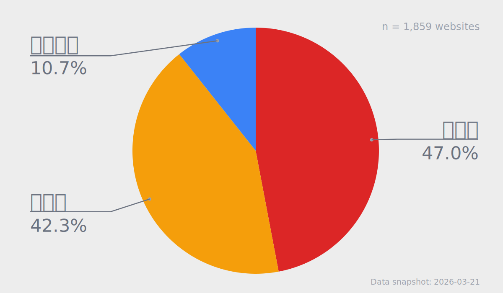
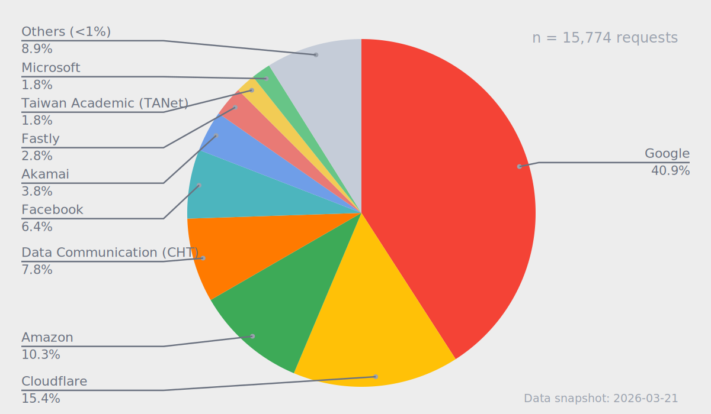

# 海纜斷光會怎樣？認識台灣的國際網路中斷風險<!-- omit in toc -->
## When Submarine Cables Go Dark: Understanding and Preparing for the Risks of Taiwan’s International Internet Disconnection<!-- omit in toc -->

### 作者

陳心一 Irvin Chen   
開放文化基金會 Open Culture Foundation ([ocf.tw](https://ocf.tw))  
MozTW, Mozilla 台灣社群 ([moztw.org](https://moztw.org))  

### 更新日期

Published: 2026-03-23  
Last Updated: 2026-05-06

### 誌謝

 
This work was supported by a grant from the [APNIC Foundation](https://apnic.foundation/), via the [Information Society Innovation Fund (ISIF Asia)](https://apnic.foundation/home/isifasia/).

## 摘要

本研究探討當台灣發生大規模國際海底電纜中斷時，日常常用網路服務的可用性。透過瀏覽器觀測網站首頁資源要求，追蹤頁面依賴資源的來源，作為風險評估指標。

本研究聚焦兩項核心議題：（一）台灣常用網站對境外資源的依賴程度（二）台灣常用網站對跨國雲服務境內節點的依賴程度，並發展量測的方法框架，將抽象的「海纜斷光的斷網風險」，轉化為具體的服務依賴結構分析，結果可作為政策與產業韌性規劃的基礎。

經檢測 1859 個台灣常用網站，結果顯示，47.0% 的網站為第一類「境外依賴型」，存在境外資源依賴暴露，在海纜斷光情境下，具有較高的直接失效風險。另有 42.3% 的網站為「雲端依賴型」，雖未觀測到境外資源依賴，但依賴跨國公有雲在台節點資源，在境外連線中斷時的實際可用性，存在高度不確定。

## 目錄<!-- omit in toc -->

- [摘要](#摘要)
- [研究背景](#研究背景)
  - [台灣是網路高度普及的社會](#台灣是網路高度普及的社會)
  - [日常網路服務如何依賴國際連線](#日常網路服務如何依賴國際連線)
  - [台灣作為島國的海纜脆弱性](#台灣作為島國的海纜脆弱性)
  - [歷史案例：多條國際海纜同時故障](#歷史案例多條國際海纜同時故障)
  - [歷史案例：馬祖全島斷網](#歷史案例馬祖全島斷網)
  - [衛星作為替代方案的數量與頻寬問題](#衛星作為替代方案的數量與頻寬問題)
  - [為何今日的風險高過 2006](#為何今日的風險高過-2006)
  - [社會認知與現有研究之不足](#社會認知與現有研究之不足)
  - [小結](#小結)
- [研究問題](#研究問題)
- [研究標的與環境](#研究標的與環境)
  - [建立常用網站清單](#建立常用網站清單)
  - [測試環境](#測試環境)
- [研究方法](#研究方法)
  - [指標定義與風險分類框架](#指標定義與風險分類框架)
- [研究實作與資料處理](#研究實作與資料處理)
  - [擷取測試資料](#擷取測試資料)
  - [單一網站測試流程](#單一網站測試流程)
  - [批次測試流程](#批次測試流程)
  - [建置個別網站查詢頁面](#建置個別網站查詢頁面)
- [研究結果](#研究結果)
  - [整體結果](#整體結果)
  - [結果說明](#結果說明)
  - [國際公有雲依賴狀態分析](#國際公有雲依賴狀態分析)
  - [國際公有雲資源位置](#國際公有雲資源位置)
  - [資源位置／雲平台依賴狀態統計](#資源位置雲平台依賴狀態統計)
  - [資源來源分布](#資源來源分布)
  - [公共機關整體風險](#公共機關整體風險)
- [研究建議](#研究建議)
  - [政策面建議](#政策面建議)
  - [技術面建議](#技術面建議)
- [研究限制與後續方向](#研究限制與後續方向)
- [參考連結](#參考連結)

## 研究背景

### 台灣是網路高度普及的社會

台灣是高度數位化的社會，網際網路及其上層的資訊系統，是社會運作的關鍵基石。社會對於網路的數位依存仍持續成長，截至 2024 年，台灣寬頻固網家戶普及率上升至 74.5%[^ncc-usage]；行動寬頻普及率達 87.12%；整體上網率則從 2006 年的 67.2% 提升至 88.75%[^twnic-usage]。

從起床到就寢，人人無時無刻都盯著各種連結網路的螢幕，存取與交換各種資訊。網路深度嵌入日常生活與社會活動之中。通訊、商業交易、媒體傳播、物流系統，以及公共與政府服務，皆依賴網路上的數位資訊系統運作。

這種極高的數位連通率，意味著任何具規模且持續一定時間的網路中斷，都可能對經濟與社會造成顯著衝擊。

### 日常網路服務如何依賴國際連線

當使用者在手機上開啟一個 App（例如 Line）並回覆一則訊息時，實際上會觸發一連串的網路請求。

首先，App 透過作業系統發起連線需求，裝置會向電信業者提供的 DNS 查詢目標伺服器（例如 Line 主機）的 IP 位址。取得位址後，裝置透過 TCP/IP 協定建立連線，送出請求。

資料從手機發出，經由無線通訊傳送至鄰近的行動電話基地台，再透過電信業者的光纖骨幹網路進入核心機房。因 Line 的主要伺服器位於境外（日本），流量將被轉網國際出口，經由淡海或頭城的海纜登陸站，透過海底電纜傳輸至海外。

到達目的地國家後，資料同樣途經登陸站回到地面，經由當地網路進入雲端服務業者（如亞馬遜 AWS、Google Cloud、微軟 Azure）之資料中心，由應用伺服器處理後，再沿原路徑，回傳至使用者裝置，由手機作業系統及 Line 處理後顯示出來。

上述過程通常在幾分之一秒內完成，雖然你沒有察覺，但實際上資料可能已跨越數千公里，來回了台灣日本一圈。又或者經過數萬公里，到了另一大州的某個雲端主機，才又回到台灣。

更重要的是，一個 App 或網站的點擊瞬間，往往已同時觸發多個請求，重複上述流程數十、上百次。多數日常使用的數位服務本質上是「跨國系統」，而看似即時的數位互動，背後高度依賴看不到的國際連線與海底電纜。

### 台灣作為島國的海纜脆弱性

如前所述，我們日常每天使用網站與 App，實際上許多都依賴境外資源與國際連線。一旦失去對外連線，絕大部分數位服務可能都無法正常運作。

台灣作為島國，對外通訊超過 99% 仰賴國際海底電纜[^cna-cables]。因此，海纜的通訊韌性，直接關係到日常中各種服務的可用性，等同於整體社會運作的韌性。

海底電纜是數公分直徑的多層纜線，放置在海床上，或於淺海處埋入海床一至三公尺深度。在台灣海峽之類深度較淺，人類活動密集的水域，容易因船隻下錨、漁撈作業、抽砂船活動等人為意外而受損。除此之外，另有自然因素，包含自然耗損、放大器故障、地震土石流，及地緣政治的相關風險。而人為因素，為台灣海纜損壞的最主要原因[^moda-report]

根據台灣海纜動態地圖（smc.peering.tw）可用性統計，台灣幾乎長期處於「至少一條海纜故障」的狀態[^smc-map]。這意味著，海纜故障或許並非例外事件，而是長期存在的系統背景要素。

2025/3/18-2026/3/18 期間，台灣所有國際對外海底電纜的可用性狀況（資料來源：台灣海纜動態地圖（smc.peering.tw）〈海纜狀態時間軸〉。

目前台灣透過淡水、八里、頭城、枋山等四處登陸機房（另有一興建中之站點於台東大武），以十四條國際海纜連結全球網路，另有十條國內海纜連接澎湖、金門、馬祖等離島[^moda-subseacable]（註：RNAL 及 FNAL 為同一條實體纜線上的兩個海纜系統，數發部將其分開計數，故另得十五條國際海纜之數目）。在正常情況下，因網際網路的網狀、冗餘、多樣與連通等要素，當少數海纜發生故障時，可由電信商調整訊號轉由其他海纜傳輸。儘管連線品質有所下降，但你或許不會感覺到有任何差異。

然而，一旦多條海纜同時受損，整體頻寬冗餘將迅速耗盡，產生較嚴重的堵塞，或大規模服務中斷，對通訊、物流、政府運作與各類數位系統造成廣泛衝擊[^aei-resilience]。

### 歷史案例：多條國際海纜同時故障

多條海纜同時故障的情境，近期才剛發生。2025 年 12 月 25 日至 2026 年 1 月 3 日，宜蘭外海一系列海底地震，造成六條國際海纜受損（含 EAC1、SJC2、PLCN、F/RNAL、EAC2、Apricot 等，總數近半）[^moda-report]，至 2026 年 3 月仍未完全修復。民間也傳出感到網路速度下降與特定應用受阻礙的聲音。

相較之下，2006 年恆春外海地震為為更具代表性的歷史案例：2006 年 12 月 26 日晚上八點 26 分及 34 分，恆春西南外海發生兩起規模 7 的地震，並引發多次餘震。雖然本島受災相較對輕微，但造成海底大規模山崩，損壞當時六條對外海纜中的四條。

此事故嚴重中斷台灣對外的國際通訊，初期台灣對美國的電話撥通率僅剩 40%，對中國、日本剩約 10%。不僅台灣，中國、香港、日本、韓國、東南亞各國的國際通訊，也都受到劇烈衝擊。在網路服務方面，Google、Yahoo、MSN、Gmail、維基百科等主要服務，在多國均有大幅中斷。也影響國際經貿及金融交易。

事發後共有八艘海纜船參與搶修，截至 2007 年 2 月中，歷時近兩個月才完全修復。[^ofta-2007] 聯合國國際減災策略署（ISDR）主任形容此次地震對海底電纜的損害，是現代新型態災難。[^msn-isdr]

兩起事件顯示，即使未達完全斷線，多條海纜同時故障，仍足以造成嚴重壅塞與廣泛服務異常。

### 歷史案例：馬祖全島斷網

2023 年初的馬祖斷網事件，則成為一地區對外海纜完全中斷的實際案例。

馬祖對台灣連線的兩條海纜，當時在 2023 年 2 月 2 號及 2 月 8 號陸續遭中國漁船損壞，因而導致區域對外的網路與電訊完全中斷，僅剩頻寬極為有限的微波（2 Gbps）支援，多數民眾難以上網[^matsu-facebook]。直到三月底，歷經 50 天後，才修復其中一條台馬 3 號海纜，恢復正常連網。

台馬 2 號及 3 號海纜總頻寬為 1 Tbps，在 2023 年事件後，台馬微波通訊頻寬擴展至 12 Gbps，於 2025 年 1 月 15 日及 1 月 22 日，馬祖再次發生兩條海纜陸續中斷的事故，此時則經由擴增後的微波通訊，得以維持一定程度的連線能量。[^twreporter-matsu]

### 衛星作為替代方案的數量與頻寬問題

2006 年事件初期，中華電信透過調撥中新一號通訊衛星，支援國際電話通訊，在短期間內恢復部分國際語音電話可用性。如果現代再次發生同等規模的事故，衛星是否也可以作為替代方案？

根據國家太空中心（TASA）的「B5G 低軌通訊衛星計畫」[^b5g-satellite]，台灣正積極研發低軌衛星技術，計劃在 2030 年前發射首批兩顆實驗性低軌通訊衛星，設計壽命為 3 年。

然而，根據前任國家太空中心董事長吳政忠估算，考慮到低軌衛星的軌道高度過境時間及涵蓋範圍，想要達到覆蓋全台 24 小時不中斷通訊覆蓋，至少需要部署 120 顆以上的衛星[^taiwan-satellite]，且以三年壽命考慮，還需逐年補充 40 顆衛星。與現行計畫規模有顯著落差，難以構成實質的備援通訊管道。

且衛星的通訊頻寬，跟海纜有極大落差。單條現代海纜的容量可達上百 Tbps，如 Apricot 海纜設計容量達 211 Tbps[^fcc-scl-00512]，而低軌衛星例如 Starlink 的通訊容量，2023 年研究推估僅有 20 Gbps，約差距一萬倍；而整個 Starlink 系統於 2023 年已部署 3300 顆衛星，推估總容量約 20 Tbps，僅約相當於單個海纜系統的量級[^starlink-capacity]。

就算將現行所有低軌衛星計畫的頻寬容量（Gbps 等級）加總，仍然無法完全替代海底電纜所提供的跨洋流量（Tbps 等級）。台灣網路資訊中心董事長黃勝雄比喻「海纜的吞吐量像是水庫，衛星就像是一條水管」[^twreporter-matsu]。因此，衛星只能作為政府對外或地區型災難的緊急通訊備援，無法作為服務全國聯外所需的替代方案。

### 為何今日的風險高過 2006

2006 年海纜事故時，境外連線中斷，對社會經貿的主要影響，主要在於國際電話通訊的中斷，主要影響跨國金融交易及特定行業。境外網路服務的受阻，僅為當時少數網路使用者的困擾。

但近二十年來，社會對網路的依賴已大幅增加。2006 年台灣連外總頻寬僅 147.7 Gbps，至 2026 年已成長至 10.6 Tbps，將近 70 倍[^twnic-bandwidth]。同時，台灣海纜年平均損害達 5.1 次，遠高於全球平均每年 0.1 至 0.2 次，風險約為全球平均的 25 至 50 倍[^cna-cables]。

根據 Deloitte 於 2016 年的估算，如台灣這樣的高度數位化國家遭遇全面性網路中斷，每千萬人口每日的 GDP 損失影響高達 2,360 萬美元。換算台灣每日經濟損失預估五千五百萬美元，單月則可能達到十七億美元。此尚未納入半導體供應鏈及跨國金融交易中斷，對國際經濟造成的衝擊等間接損失[^deloitte-report]。

更重要的是，上述研究同時指出，即使未達全面中斷，僅為部分服務阻斷或頻寬降低，亦會透過生產力下降、交易延誤、資訊取得困難與投資信心降低等因素，對經濟活動造成實質影響。

今日台灣不僅更依賴網際網路，也面對更高頻率的海纜故障風險。若再次發生類似 2006 年的大規模中斷事件，影響將不再限於特定產業，不但對社會的衝擊更為廣泛，且應急處理與尋求替代路徑的困難度，也將遠遠高過當年。

### 社會認知與現有研究之不足

雖然近年台灣社會對於海纜斷線的討論熱度增加，但話題多停留在其對「通訊」的阻礙上。諸如跨國通訊服務受阻，如 Line / Messenger / WeChat 等服務，或者 Google、Gmail、Office 365 等雲端或辦公軟體無法使用。社會對於此類事件的認知，離 2006 並不太遠。

學術方面，目前關於網路韌性的探討，則聚焦於基礎設施層面，例如海纜拓樸、路由協定、DNS 系統[^dns-paper-1][^dns-paper-2]，或 CDN、雲端服務集中化等基礎或中介層問題。這種方向往往隱含一項關鍵前提：只要基礎設施仍然存在且可連通，網路服務即具有可用性。

網路路由的本質是高度分散且不完美的系統，故障是日常運作的一部分。路由亦高度受政策所約束，即使在沒有實體中斷的情況下，路由錯誤、設定失誤或節點異常，仍可能導致大規模的服務中斷。因此，單純從「基礎設施是否安好」來評估網路韌性，無法完整反映服務實際可用性。[^routing-paper-1]

在事故時，即使仍有替代海纜可使用的情境下，仍可能因流量重分配、路由策略限制、或關鍵路徑集中等原因，而導致通訊最終仍然受阻。故「物理上可連通」並不等同於「實際可達」[^routing-paper-2]，單純的冗餘設計並不足以確保跨國網路可用性[^csis-cables]。

因現代網路架構橫跨基礎設施層、邏輯層與應用層，且社會與經濟影響，超出單一業者可控制或投資的範圍，因此，網路韌性不僅屬於基礎設施營運商的責任，也具有公共財特性，涉及跨層、跨業者與跨國界的問題。[^aei-resilience]

既有韌性指標如 Internet Resilience Index，則以國家層級的基礎設施、效能、安全與市場結構作為代理指標，評估一國網路生態系的整體韌性[^isoc-iri]。然而，這類指標未直接量測使用者日常實際造訪的網站，在國際連線受限或中斷時是否仍能完整載入與使用。

政策與戰略層級的分析，亦從國家基礎設施、海纜拓樸、修復能力、替代通訊技術、及地緣政治風險等面向，分析數位連通性的脆弱性與韌性策略。強調頻寬冗餘、路徑多樣性、修復能力與國際合作的重要性，並提出相應的政策建議。[^stanford-policy]

對於網站對第三方服務（如 DNS、CDN、CA）的依賴程度問題，既有研究聚焦於其集中性及潛在的單點失效風險[^africa-thirdparty]。超過 89% 的網站在關鍵功能上依賴第三方服務，且前三大服務提供者支撐超過 90% 的網站運作[^thirdparty-centralization]。多層級的間接依賴，也可能將單一故障的影響放大數十倍[^thirdparty-dependencies]。

網路韌性不僅要考慮實體設施的可連通性，也需要將服務在對外受阻時的可用性，及其依賴第三方服務的狀態納入考量。因此，本研究希望著重於「服務在受限連線環境下的可用性」，在應用面上發展全面的分析方法，探討「當一地失去對外連線能力時，日常使用的數位服務，有哪些及多少比例仍能維持服務可用性」，以進一步拆解聯外海纜故障的情境，對網路及社會韌性的潛在衝擊。

### 小結

綜合以上，台灣面對的問題不是「海纜會不會斷」。確切的問題是服務崩潰風險：在高度數位化、服務高度雲端化、應用架構高度跨國依賴的今日社會，一旦對外連線大幅受阻，哪些日常數位服務仍能維持基本功能，哪些會退化，哪些會直接失效。

過去對海纜風險的討論，多半聚焦於通訊頻寬、基礎設施損壞與替代通訊媒介。然而，現代網路服務早已不是本地伺服器回應靜態網頁的模式。一個看似「台灣的」網站或 App，實際上可能架設在某個雲端服務上，分布在不同地區的機房；同時依賴雲端主機、CDN、第三方 JavaScript、登入系統、金流服務、流量分析、推播服務、AI API 或其他外部元件。只要其中任何關鍵環節位於境外，或需透過境外路徑取得，服務就可能在海纜中斷時出現非預期失效。

且屆時在國際網路連線不通或極度壅塞的狀態下，想要修復或重建相關的資訊系統，將會變成更為困難的事情。

海纜大規模故障的影響，不能只用「還有多少替代海纜或頻寬」來判斷。即使物理網路尚未完全斷線，服務也可能因路由策略、DNS 解析、流量壅塞、雲端依賴，或外部資源不可及而無法正常運作。換言之，我們認為，除網路連通性外，仍需要評估使用者實際依賴的數位服務可用性。

如果我們未完全了解「海纜大規模斷線」的實際影響，我們就無法對其做出準備。這也是本研究的出發點：將抽象的「海纜斷光會怎樣」，轉化為可量測、可比較的技術問題。補足現有韌性討論中較少觸及的應用層缺口。透過建立測試框架，觀察常用數位服務在失去境外連線情境下的載入、退化與失效狀況，為後續的備援設計、提升韌性、政策與社會準備提供具體依據。

<!-- FIXME: 校驗至此 -->

## 研究問題

當高度仰賴國際網路的島嶼型國家（例如台灣），失去其對外海纜連線，亦即失去國際網際網路時，其國內主要數位服務運作、退化或失效的程度。

本研究希望發展一套方式，針對資訊服務運作時所需的境外元件——例如 CDN、第三方 API、雲端平台、與外部程式庫，進行系統化的測試統計，以描繪出社會常用的數位服務，在境外網路隔離情境下的依賴結構與潛在可用性風險。

本研究將為政府、產業與社會提供更具體的證據與分析基礎，理解境外連線中斷的系統性衝擊規模，以進一步作為制定數位服務與社會基礎部門韌性提升的策略基礎。

本研究關注兩項核心議題：

1. 網站對境外資源的依賴程度  
2. 網站對跨國雲服務在台灣節點的依賴程度，以及此類依賴反映的韌性意涵

需要強調的是，本研究並不直接驗證網站完整後端架構或雲端服務之控制面依賴，而是以程式化瀏覽器檢視網站載入過程中可觀測的資源請求作為分析基礎，將資源來源分布視為依賴結構的代理指標。

以下為本研究回答的三個具體問題：

1. 在「台灣對外連線大幅受阻或中斷」的情境下，台灣人**常用網站中，有多少比例在首頁層級會立刻受影響？**
2. 風險是否**集中在特定雲端服務生態**？
3. 不同屬性的網站（例如`.gov.tw`政府網站、`.edu.tw`教育網站、與一般服務），其**本地韌性是否存在系統性差異？**

## 研究標的與環境

本研究整理出一份台灣的高流量網站，作為測試目標。清單同時包含台灣本土的服務，以及台灣常用的國際服務。研究標的不限於「台灣網站」，而是「台灣人會用的網站」，故此清單中亦包含 Google、Gmail 等國際服務。

本研究測試的標的是「網站」（Web），不直接等同 App 可用性。（開放文化基金會目前另有相關計畫，針對 App 的連線韌性進行研究）

### 建立常用網站清單

目前尚無「台灣人常用網站」的權威清單，因此本研究整併以下多個來源，整理出不重複的測試網站清單。

- [Tranco List](https://tranco-list.eu/) - 全球前 100 萬網站排名，取 .tw 的網站。
- [Cloudflare Radar](https://radar.cloudflare.com/) - Cloudflare 的台灣流量排名（前 100 名）
- [AhrefsTop](https://ahrefstop.com/websites/taiwan) - Ahrefs 的台灣 Organic Search 流量排名（前 100 名）
- [SimilarWeb](https://www.similarweb.com/top-websites/taiwan/) - SimilarWeb 的台灣網站流量排名（前 50 名）
- [Semrush](https://www.semrush.com/trending-websites/tw/all) - Semrush 的台灣網站流量排名（前 100 名）

測試清單 [merged_lists_tw.json](https://github.com/irvin/top-traffic-website-list-taiwan/blob/553b50a143f52a0c189afbee6c335e846aace004/merged_lists_tw.json) 更新於 2026 年 1 月 6 日，共納入 2109 個網站，並依照流量高低先後排序，可用以衡量特定網站重要性。

除以上 2109 網站外，本研究另加入數個手動指定測試站點[manual_curated_list_tw.json](https://github.com/irvin/web-resilience-test/blob/a4c53e30acda30fbf39dab2023a5fdb4d866ef2c/manual_curated_list_tw.json)（例如 OCF、SITCON、g0v 等）以涵蓋台灣開源與數位韌性社群關注個案。

相關清單與 script 開源於 [top-traffic-website-list-taiwan](https://github.com/irvin/top-traffic-website-list-taiwan/) 專案。

### 測試環境

本研究使用一般台灣常見的家用網路環境進行測試，包括以下屬性：

- 一般家用中華電信光世代 500M/500M 網路
- 測試位置：新北市中和區、台北市中正區
- DNS：168.95.1.1
- 相關環境資訊記錄在測試 log 中，方便後續比較或重現

## 研究方法

網站的可用性不僅取決於是否能成功建立網路連線，亦取決於其能否取得所依賴的多重資源（如 JavaScript、樣式表、圖片與 API）。現代網站通常由多個不同網域所提供的資源組成，這些資源共同決定最終呈現給使用者的內容與功能。既有研究指出，可透過 headless 瀏覽器分析網站資源請求行為，推導網站對第三方網域資源的依賴關係[^dependency-analyzer][^thirdparty-centralization]。

本研究在「以網站資源請求行為為基礎的依賴暴露分析」之方法基礎上，將依賴結構分析延伸至「國際連線中斷」之系統性條件情境，進一步觀察其對實際服務可用性的影響。

由於網站的後端架構、資料傳輸、控制面依賴、與雲端內部運作機制，無法直接從外部觀測，本研究不試圖驗證完整系統依賴關係，而聚焦於網站前端可觀測的網路資源請求行為（network requests），並據此建立可操作化指標。

### 指標定義與風險分類框架

具體而言，本研究定義以下兩項核心指標：

1. 境外資源依賴暴露（Foreign Dependency Exposure）  
   指網站 requests 中是否存在境外資源請求，用以衡量網站在資源取得層面，對境外網路的依賴暴露。

2. 跨國雲本地節點依賴暴露（Cloud Local Endpoint Exposure）  
   指網站 requests 中是否存在跨國雲端服務在台灣節點的請求，用以衡量網站是否直接位於、或對跨國雲在地節點有依賴暴露。

此兩項指標，反映的是網站在首頁前端資源層的「依賴暴露結構」，而非完整系統架構與實際故障行為。

基於上述兩項指標，本研究進一步將網站區分為三種類型：

1. 境外依賴型（Foreign-dependent）  
   存在境外資源依賴暴露：網站首頁載入直接依賴境外資源。於境外連線中斷情境下，較可能立即受影響，屬於直接風險最高的類型。

2. 雲端依賴型（Cloud-dependent）  
   無境外資源依賴暴露，但存在跨國雲本地節點依賴暴露：網站首頁載入無直接請求境外資源，但有跨國雲在台節點提供的資源。此類網站具備一定程度的在地化，但其實際可用性，取決於雲端控制面、來源架構與快取持續能力，因此屬於「表面具在地樣態、實際仍可能有跨境依賴」的狀況，具有較高的不確定性。

3. 本地型（Locally-contained）  
   無境外資源依賴暴露，亦無跨國雲在台節點依賴暴露：網站前端可觀測範圍無依賴境外資源，也無依賴跨國雲在台節點。呈現相對較高的本地運作可能性，但仍不代表其完整系統在境外網路中斷時，必然持續可用。

## 研究實作與資料處理

本研究所使用的研究工具包含以下專案：

- [top-traffic-website-list-taiwan](https://github.com/irvin/top-traffic-website-list-taiwan) 收集統整台灣常用網站
- [web-resilience-test](https://github.com/irvin/web-resilience-test) 網站韌性測試工具
- [web-resilience-test-profile](https://github.com/irvin/web-resilience-test-profile) 編譯上述測試結果成靜態網頁
- [resilience.ocf.tw](https://github.com/ocftw/resilience.ocf.tw) 公開之測試結果查詢網站

### 擷取測試資料

本研究開發 [web-resilience-test](https://github.com/irvin/web-resilience-test) 工具，針對上述研究標的網站的首頁，運用程式化的 headless 瀏覽器進行逐站開啟，並紀錄其頁面載入時的所有資源連線。

接著，本工具針對每一項資源，統計所有請求的網域，並排除已知為廣告用途的網域。接著針對這些網域，透過 IPinfo / header 資訊 / ping RTT，判斷其實際地理位置及邏輯位置（例如來自哪一個公有雲服務）。

最後，本工具針對所有測試結果進行統計，整理成結果數據表格。

### 單一網站測試流程
  
[`no-global-connection-check.js`](https://github.com/irvin/web-resilience-test/blob/main_w_tw_result/no-global-connection-check.js) 用在單一網站的測試，流程如下：

  1. 前置初始化
     - 環境初始化，並載入排除網域清單
     - 正規化測試目標網址（如補完 `https://` 等）

  2. 載入頁面與蒐集請求
     - 運用 Playwright 套件的 headless Chromium 模式，打開測試網站
     - 監聽 `request` 以收集所有資源 request 的相關資料（包含 headers 資訊）

  3. 重試機制與錯誤處理
     - 如發生 4xx 錯誤，則視為測試失敗，並紀下相關資訊
     - 如果遭遇其他錯誤，則按照下列順序，個別改用不同瀏覽器模式及針對不同網址進行測試：  
       - headless 瀏覽器／非 headless 瀏覽器
       - 網址前方加入 `www.`／移除網址前方的 `www.`
     - 如經過上述四種變化，仍然遭遇錯誤，則紀錄相關資訊並跳到下一個測試網站

  4. 清理 request 資料
     - 針對個別網站的 request 資訊，進行以下清理：
       - 過濾掉所有的 `blob:` 請求
       - 套用 adblock domain 清單，以過濾廣告等不必要資源
       - 根據 hostname 整理出不重複連線伺服器清單

  5. 判定網域位置
     - 針對前述 hostname 清單，呼叫 IPinfo API，取得其位置資料
     - 如果查詢的資料顯示 `country=TW`，則紀錄為境內連線
     - 若查詢的結果顯示 `country` 非 `TW`，則根據連線的 ASN，判定是否來自國際公有雲節點（Google / Cloudflare / Amazon / Fastly / Akamai / Microsoft），並進入下一步的進階判定：
       - Header 判定：檢查連線的 response header，是否包含 `cf-ray`、`x-amz-cf-pop`、`x-served-by` 等雲端系統已知的位置標記。
       - RTT 判定：若無法從 header 擷取到明確的位置資訊，則針對該資源進行 `ping` 5 次，取最小 RTT。如果 `RTT < 15ms`，則將其判斷為台灣境內資源。

     註：本研究另參酌測試過程的完整 request 資料，建立公有雲的對應 ASN 清單 [cloud_providers_tw.json](https://github.com/irvin/top-traffic-website-list-taiwan/blob/16dbb8bbdeb5e27397961556c7aa9ae54767742d/cloud_providers_tw.json)，除供判定使用外，也同步開源供其他研究與專案參考。

  6. 分類資源，建立韌性指標數據
     - 根據上述資訊，將每個資源域名分為以下四類之一：`domestic/cloud`、`domestic/direct`、`foreign/cloud`、`foreign/direct`。
         - 「cloud」指 `ipinfo` 的 `org` 所含 ASN 包含於 `cloud_providers_tw.json` 的 `providers_intl` 與 `providers_intl_without_known_taiwan_region/pop` 列表中者。
     - 計算網站的四個類型的 request domain 總數，並將結果儲存為 `test-results/<site>.json` 檔案。

  7. 錯誤處理
     - 如上述流程中發生錯誤，則將相關資訊紀錄至 `test-results/_error/<site>.error.json` 檔案。
     - 測試流程中，常見的錯誤類型包含：
       - `Cloudflare Challenge`（目標網站採取 Cloudflare 的機器存取保護機制）
       - `HTTP 4xx Error`
       - `Timeout`

### 批次測試流程
  
[`batch-test.js`](https://github.com/irvin/web-resilience-test/blob/main_w_tw_result/batch-test.js) 會呼叫上述單一網站測試工具，針對測試目標列表批次執行，並輸出結果統計資料成 `test-results/statistic.tsv` 檔案。

從上述批次資料中，即可繼續進行統計分析，得知整體的網站對境外依賴比例，及個別資源的韌性狀態。

### 建置個別網站查詢頁面

本研究使用 [web-resilience-test-profile](https://github.com/irvin/web-resilience-test-profile) 工具，將個別測試結果編譯成個別靜態頁面，並架設 [https://resilience.ocf.tw/](https://resilience.ocf.tw/) 網站，供公眾自由查詢個別網站的韌性狀態。（例如 [海纜斷掉時，ocf.tw 會動嗎？](https://resilience.ocf.tw/web/ocf.tw/)）。

本工具從測試到編譯出結果頁面，在兩千個網站的數量級時，如以預設值（平行測試 4 個網站，平行編譯 8 個網站），需時約 30~60 分鐘。最新的測試結果，目前公布於 [web-resilience-test-result](https://github.com/irvin/web-resilience-test-result) 專案，以及 [resilience.ocf.tw](https://resilience.ocf.tw/) 網站。

## 研究結果

本研究共測試了 2157 個網站，其中 1859 個網站完成測試。

- 資料彙整日期：2026 年 4 月 17 日
- 測試網站清單： 
  - [merged_lists_tw.json@553b50a](https://github.com/irvin/top-traffic-website-list-taiwan/blob/553b50a143f52a0c189afbee6c335e846aace004/merged_lists_tw.json) 
  - [manual_curated_list_tw.json@28160ed](https://github.com/irvin/web-resilience-test/blob/28160ed0555b6d732800517e208bef8cadc5b1eb/manual_curated_list_tw.json)
- 測試結果總表： [statistic.tsv@3908084](https://github.com/irvin/web-resilience-test-result/blob/39080848acd5872f97dbe3d606676c664e92ce7f/statistic.tsv)
- 國際公有雲統計： [asn_taiwan_ratio.tsv@3908084](https://github.com/irvin/web-resilience-test-result/blob/39080848acd5872f97dbe3d606676c664e92ce7f/asn_taiwan_ratio.tsv)

### 整體結果

在本研究的分類框架下，47.0% 的網站為「境外依賴型」，呈現境外資源依賴暴露，顯示其在海纜斷光情境下，**具有較高的直接失效風險**；另有 42.3% 的網站為「雲端依賴型」，雖未觀測到境外資源依賴，但依賴跨國公有雲在台節點提供的資源，其實際可用性**具有高度不確定性**，僅有 10.7% 的網站為「本地型」，無呈現依賴暴露，維持正常運作的可能性較高。整體而言，共有 89.3% 的網站屬於需進一步關注的高風險或高不確定性類型。

### 結果說明

<!--
資料出處：web-resilience-test/test-results/overall_result.tsv
-->

境外依賴型：網站本身就來自境外，或開啟時有擷取境外資源，故存在高度失效風險。

雲端依賴型：雖未直接連向境外資源，但其開啟時所擷取的資源，來自跨國公有雲在台灣的節點。這些節點在網路拓樸上雖位於台灣，但其控制面、來源架構、身份驗證或快取持續能力，仍可能依賴境外系統。屬於「雖具在地落點但可用性不確定」的類型。

本地型：無呈現依賴暴露，表示其網站本身位於境內，且未呼叫境外資源，故能維持正常運作的可能性較高。

| 類型                                                     | 網站數 | 百分比 |
|----------------------------------------------------------|-------:|-------:|
| 境外依賴型（存在境外資源依賴暴露）                       |    874 |  47.0% |
| 雲端依賴型（無境外資源依賴暴露，存在跨國雲本地節點依賴） |    787 |  42.3% |
| 本地型（無呈現依賴暴露）                                 |    198 |  10.7% |
| 總計                                                     |   1859 | 100.0% |

### 國際公有雲依賴狀態分析

<!--
資料出處：web-resilience-test/test-results/asn_taiwan_ratio.tsv
參考 generate_statistic.js 產生之「Resilience=1 網站公有雲使用總結」區段及「各公有雲使用情況」區段
-->

統計第二類「雲端依賴型」的所有網站，對於不同「國際公有雲在台灣節點」的資源請求，我們得到以下結果：

- Google Cloud Platform 境內節點：共 726 個網站依賴
- Cloudflare 境內節點：共 251 個網站依賴
- Amazon Web Services 境內節點：共 118 個網站依賴
- Akamai 境內節點：共 94 個網站依賴
- Fastly 境內節點：共 34 個網站依賴
- Azure 境內節點：共 3 個網站依賴

無國際依賴的 985 個網站中，共有 726 個網站需取用 GCP 境內節點的資源，占比超過七成（73.7%）。

據此可知，如果 GCP 等公有雲服務，在境外網路中斷時，境內節點無法維持正常運作，將會造成非常高的衝擊。換言之，這些公有雲服務的韌性，是網站能否在海纜障礙的情境下，維持正常運作的關鍵因素。

### 國際公有雲資源位置

<!--
資料出處：web-resilience-test/test-results/asn_taiwan_ratio.tsv
參考 generate_statistic.js 產生之「公司合計統計」區段
-->

我們另外檢視所有對國際公有雲境內外位置請求資源的的網站數分佈，發現以下結果：

| 名稱         | 網站數 (國內節點) | 網站數 (國際節點) |
|--------------|-------------------|-------------------|
| Google       | 1444              | 32                |
| Cloudflare   | 672               | 298               |
| Amazon       | 414               | 231               |
| Akamai       | 352               | 9                 |
| Fastly       | 122               | 218               |
| Microsoft    | 5                 | 167               |

以 Google 雲端為例，資源來自其境內節點的佔比居然高達 97.8%，境外節點僅佔約 2.2%。此結果顯示 CDN 等相關技術發展，對於資料在地化（Data Localization）的實際助益。另外也表示，這些在台節點保存鏡相資源之持續可用時間，將是境外擁塞或斷線時，影響一般網站的服務之存續狀態的關鍵要素。

對於境內資源比例較低的公有雲服務，可進一步評估其是否具備在國內建立完整鏡相備援、快取持續與應變運作機制的可行性。

### 資源位置／雲平台依賴狀態統計

<!--
資料出處：web-resilience-test/test-results/dependency-breakdown.tsv

原始資料計算方式：
公有雲 / 境內 = results_domestic_cloud  > 0 的網站數
公有雲 / 境外 = results_foreign_cloud   > 0 的網站數
公有雲 / 總計 = total_cloud             > 0 的網站數
非雲 / 境內   = results_domestic_direct > 0 的網站數
非雲 / 境外   = results_foreign_direct  > 0 的網站數
非雲 / 總計   = total_direct            > 0 的網站數
總計 / 境內   = total_domestic          > 0 的網站數
總計 / 境外   = total_foreign           > 0 的網站數
僅用到境外資源 = total_foreign > 0 且 total_domestic = 0 的網站數
-->

分析台灣常用網站對「境內／境外」及「國際雲／其他」之之資源依賴狀態，以「網站至少出現一項該類資源請求」為基準，結果如下：

| 單位：網站數及採用率 | 境內         | 境外        | 總計         |
|----------------------|--------------|-------------|--------------|
| 國際公有雲           | 1582 (85.1%) | 802 (43.1%) | 1641 (88.3%) |
| 非雲                 | 1363 (73.3%) | 195 (10.5%) | 1436 (77.2%) |
| 總計                 | 1793 (96.4%) | 874 (47.0%) |              |

88.3% 的網站依賴國際公有雲資源，其中包含 85.1% 的網站依賴境內公有雲資源，以及 43.1% 的網站依賴境外公有雲資源。

另外，在 874 個有境外資源依賴的網站中，多數仍同時取用境內資源，只有 66 個（3.6%）網站僅使用境外資源。顯見 CDN 等相關技術發展，對於資料在地化（Data Localization）與提升網路韌性的實際助益。

### 資源來源分布

<!--
資料出處：web-resilience-test/test-results/resource-distribution.tsv
-->

如果將所有資源請求，根據 ASN 進行統計排序，可發現網站依賴資源高度集中於大型供應商。其中超過 5% 的來源有 Google、Cloudflare、Amazon、中華電信及 Facebook。Google 佔比最高，達 40.9%，Cloudflare 佔比 15.4%，Amazon 佔比 10.3%。

分析個別網站檢測資料，來自 Google 的主要資源有 GTM 等；而 Cloudflare 則提供 [cdnjs](https://www.cloudflare.com/zh-tw/cdnjs/) JavaScript CDN 與 WAF 等基礎架構與服務。這些常用基礎服務，共同構成當代網路服務韌性的關鍵環節。

| 單位                                 |    總數 |  百分比 |
|--------------------------------------|--------:|--------:|
| Google                               |   6,452 |  40.9%  |
| Cloudflare                           |   2,435 |  15.4%  |
| Amazon                               |   1,627 |  10.3%  |
| Data Communication (CHT)             |   1,234 |   7.8%  |
| Facebook                             |   1,013 |   6.4%  |
| Akamai                               |     599 |   3.8%  |
| Fastly                               |     442 |   2.8%  |
| Taiwan Academic (TANet)              |     285 |   1.8%  |
| Microsoft                            |     284 |   1.8%  |
| Oracle                               |      95 |   0.6%  |
| New Century                          |      93 |   0.6%  |
| Taiwan Fixed Network                 |      79 |   0.5%  |
| Automattic                           |      59 |   0.4%  |
| Yahoo                                |      58 |   0.4%  |
| Incapsula                            |      56 |   0.4%  |
| Baidu                                |      54 |   0.3%  |
| Zenlayer                             |      53 |   0.3%  |
| Sony                                 |      47 |   0.3%  |
| internet content provider (yahoo jp) |      44 |   0.3%  |
| Byteplus                             |      34 |   0.2%  |
| Magnite                              |      33 |   0.2%  |
| AboveNet                             |      25 |   0.2%  |

### 公共機關整體風險

<!--
資料出處：web-resilience-test/test-results/asn_taiwan_ratio.tsv
-->

分析政府網站與教育機構的韌性狀態，如果僅看對境外資源的依賴，我們發現：

- 測試網站中含 200 個政府網站（包含 `gov.tw` 與 `*.gov.tw`），其中 20 個有境外連線，比例為 10.0%。
- 測試網站中含 225 個教育網站（`*.edu.tw`），其中僅 37 個有境外連線，比例為 16.4%。

| 類型     | 測試網站數量 | 存在境外連線數量 |  比例 |
| -------- | -----------: | ---------------: | ----: |
| 政府網站 |          200 |               20 | 10.0% |
| 教育網站 |          225 |               37 | 16.4% |
| 全部     |         1859 |              874 | 47.0% |

此結果顯示，政府與教育網站，在資源層面上的境外依賴，相對整體表現（47%）呈現相對較低的現象。顯示公部門與學術網路環境在本地可用性上可能具較高基礎，但其完整服務韌性仍需進一步檢驗後端依賴與使用流程。

<!-- TODO: add 失敗樣本分析 -->

## 研究建議

針對本研究的發現，我們歸納出政策面與技術面等以下建議，以提高台灣整體數位服務的韌性：

綜合本研究發現，台灣常用網站的主要風險，並非來自少數完全位於境外的服務，而廣泛存在於對境外資源、與跨國公有雲在台節點的依賴結構中。因此，提升韌性的策略不應限於聚焦「服務是否在台灣」，而應進一步檢驗其資源供應鏈、雲端控制面、與關鍵使用流程，是否具備本地持續運作能力。

<!-- TODO: 建議分眾： 政府採購與監管、關鍵基礎設施營運者、網站開發者 -->

### 政策面建議

1. 支持相關研究，持續觀測常用與關鍵服務的韌性狀態，並常態揭露整體與個別結果。
2. 支持後續研究，開發更深入的韌性測試框架流程，針對如登入、交易、瀏覽、搜尋等使用旅程，進行進一步的可用性測試
3. 針對 Google、Cloudflare、Amazon、Akamai 等境內高度依賴的國際公有雲在台節點系統，提供政策要求與預算支持，驗證並提升其境外斷線時的服務可用性。
4. 政策要求與預算支持，降低境內關鍵服務對境外資源的依賴度。以提高其本地韌性。
5. 鼓勵或要求境內關鍵服務制定本地備援機制或復原計畫，並定期進行斷線演練。
6. 根據本地可用性驗證，建立「韌性分級」標準（例如 A：完全可用；B：可降級；C：首頁可載入但互動失效；D：立即失效），納入政府與公共服務採購及驗收條件。
7.  預先制定「極端狀況頻寬分配優先級別」計劃，因應急難時備援衛星容量遠低於海纜的限制。

### 技術面建議

1. 針對 Google、Cloudflare、Amazon、Akamai 等高度關鍵的國際公有雲在各地之節點，應制定相關之連外網路障礙因應計畫，並進行定期演練。
2. 網站製作者應考慮使用境外資源的韌性風險，在呼叫框架時，可優先採有提供境內節點之 CDN 服務，或建立 fallback 機制，在函式庫載入失敗時切換到本地資源，以降低境外連線中斷時的影響。
3. 服務開發者，可針對服務之關鍵要徑（如登入、結帳等），優先進行資料在地化，以改善其韌性並提升服務品質。

## 研究限制與後續方向

以下為本研究的主要限制：

1. 本研究以網站連線請求 (requests) 的來源位置作為主要觀測對象，未直接對請求進行完整實際路徑分析（例如 traceroute），或使用 VPN 境外跳板進行他地路徑分析。故對目前取用之境內資源與頁面，是否屬於 anycast 或 CDN 節點，尚待進一步測試。

2. 本研究所衡量之「境外依賴」與「雲端依賴」，均屬於瀏覽器前端（front-end）資源層之可觀測依賴暴露，並不等同於網站完整後端架構之實際依賴關係。就算前端觀測到的資源都位於境內，其後端資料庫存取、API、或任何其他後端服務，仍可能依賴境外資源或服務。故不能將測試結果中 11% 之「前端資源都位於境內與非國際公有雲」的網站，認定為「在境外網路斷線時一定可用」。

3. 網站資源與網頁置於跨國雲服務在台灣節點，並不代表該服務在海纜中斷時必可獨立運作。其實際可用性仍可能受到以下（不限於）因素影響：
   - 控制介面（control plane）是否依賴境外資源
   - 資料來源（origin）是否位於境外
   - 快取命中率（cache hit ratio）與快取持續時間
   - 身份驗證與 session 機制
   - 其他可能影響可用性的因素

4. 本研究未進行實際「海纜中斷模擬」的故障注入測試（即透過 VPN 或 DNS 等方式，模擬境外資源無法存取的環境）。本研究之目的為針對大量網站作一概括性測試，故採用依賴結構推估潛在風險，未直接操作並觀察服務在斷線情境下的實際退化行為。

5. 本研究以網站首頁為測試目標，未涵蓋登入、交易、瀏覽、搜尋等完整使用流程，因此本結果應視為「初始可用性」評估指標。
 
綜合上述研究限制，我們建議後續可進一步探討下述方向，以建立更完整的數位服務韌性評估框架：

   - 模擬故障情境（運用技術手段，例如 VPN 或 DNS 等方式，模擬境外資源無法存取的環境），配合使用者旅程導向（如登入、交易、瀏覽、搜尋等完整使用流程）測試，觀察實際可用性
   - 針對常用雲端服務，測試分析其架構（控制介面、資料來源、快取預設設定、身份驗證機制…等）之韌性
   - 使用 traceroute 分析資源之完整路徑
   - 分析常見前端函式庫與框架（如 jQuery、bootstrap、tailwind、react、vue）的使用率與節點分佈，確認是否存在多重網站依賴的境外服務等單點故障風險。
   - 分析不同資源種類（document、script、image、xhr、font、stylesheet）間是否有依賴差異
   - 分析不同類型網站（新聞、電商、社群、搜尋引擎等）間的韌性差異
   - 鑑別「高流量但低韌性」的高風險網站
   - 加入更多台灣流量資料，例如 Chrome CrUX 使用者體驗資料集

## 參考連結

[^ncc-usage]: 中華民國國家通訊傳播委員會（NCC），《114 年通訊傳播市場報告》，https://commsurvey.ncc.gov.tw/files/file_pool/1/0p336342530469870607/251201%20%20114年通訊傳播市場報告_網站上傳版.pdf
[^twnic-usage]: TWNIC 財團法人台灣網路資訊中心，《2025 台灣網路報告 - 整體使用概況》，https://report.twnic.tw/2025/TrendAnalysis_internetUsage.html
[^cna-cables]: 中央社 CNA，〈專家：海纜如台灣「數位生命線」 99%網路頻寬都靠它〉，https://www.cna.com.tw/news/aipl/202501100036.aspx
[^moda-report]: 數位發展部，〈114年度臺灣海底通訊電纜損害原因分析及策進報告〉，https://www-api.moda.gov.tw/File/Get/moda/zh-tw/kj9vSvBw5wUeqla
[^smc-map]: 台灣海纜動態地圖，〈海纜狀態時間軸〉，https://smc.peering.tw/
[^moda-subseacable]: 數位發展部，〈最新海纜狀況〉，https://moda.gov.tw/major-policies/subseacable/1747
[^aei-resilience]: Center for Technology, Science, and Energy, American Enterprise Institute，〈Beyond Infrastructure: Internet Ecosystem Resilience and the Public Good〉，https://ctse.aei.org/beyond-infrastructure-internet-ecosystem-resilience-and-the-public-good/
[^ofta-2007]: 香港特別行政區政府電訊管理局，〈新聞公報〉，Internet Archive 備份，https://web.archive.org/web/20070217181311/http://www.ofta.gov.hk/zh/press_rel/2007/Feb_2007_r4.html
[^msn-isdr]: MSN 新聞轉載中央社，〈專家指台灣外海強震損害海底電纜為現代災難〉，Internet Archive 備份，https://web.archive.org/web/20070210045300/http://news.msn.com.tw/cna/cna_full_text.asp?yy=07&mm=02&dd=08&name=000030
[^matsu-facebook]: 李問 Wen Lii，Facebook 貼文，https://www.facebook.com/wen1949/posts/pfbid0C1juirBxeTdoaarQnzXpWBdR7C8xodHPJ3Ctrh93kF7hdeU6547KiC8SwRRvBjwfl
[^twreporter-matsu]: 報導者 The Reporter，〈海底電纜斷裂危機下，台灣維繫「數位生命線」的應變挑戰〉，https://www.twreporter.org/a/damaged-undersea-cables-raises-alarm-in-taiwan
[^b5g-satellite]: 國家太空中心，〈低軌通訊衛星〉，https://www.tasa.org.tw/zh-TW/missions/detail/Beyond-5G-LEO-Satellite
[^taiwan-satellite]: Taipei Times，〈TASA to launch six satellites from 2026〉，https://www.taipeitimes.com/News/front/archives/2024/05/13/2003817776
[^fcc-scl-00512]: Federal Communications Commission，〈PUBLIC NOTICE: Actions Taken Under Cable Landing License Act SCL-00512〉，2025年1月17日，https://docs.fcc.gov/public/attachments/DA-25-60A1.pdf
[^starlink-capacity]: Denys Rozenvasser, Kateryna Shulakova，〈Estimation of the Starlink Global Satellite System Capacity〉，https://opendata.uni-halle.de/bitstream/1981185920/103863/1/1_9%20ICAIIT_2023_paper_4290.pdf
[^twnic-bandwidth]: TWNIC 財團法人台灣網路資訊中心，〈連線頻寬登錄查詢系統〉，https://map.twnic.tw/main02.php
[^deloitte-report]: Cary Stier，〈The economic impact of disruptions to Internet connectivity: A Report for Facebook〉，Deloitte，2016 年 10 月，https://www.deloitte.com/content/dam/assets-shared/legacy/docs/perspectives/2022/economic-impact-disruptions-to-internet-connectivity-deloitte.pdf
[^dns-paper-1]: David Conrad，〈Towards Improving DNS Security, Stability, and Resiliency〉，https://www.internetsociety.org/wp-content/uploads/2021/01/bp-dnsresiliency-201201-en_0.pdf
[^dns-paper-2]: Lars Kröhnke, Jelte Jansen, Harald Vranken，〈Resilience of the Domain Name System: A Case Study of the .nl-domain〉，https://www.internetsociety.org/wp-content/uploads/2021/01/bp-dnsresiliency-201201-en_0.pdf
[^routing-paper-1]: Jian Wu, Ying Zhang, Z. Morley Mao, Kang G. Shin，〈Internet Routing Resilience to Failures: Analysis and Implications〉，https://conferences.sigcomm.org/co-next/2007/papers/papers/paper25.pdf
[^routing-paper-2]: Dan Pei, Lixia Zhang (UCLA), Dan Massey (USC/ISI)，〈A Framework for Resilient Internet Routing Protocols〉，https://web.cs.ucla.edu/~lixia/papers/04IEEENetwork.pdf
[^csis-cables]: Erin L. Murphy，〈Redundancy, Resiliency, and Repair: Securing Subsea Cable Infrastructure〉，Center for Strategic and International Studies，https://www.csis.org/analysis/redundancy-resiliency-and-repair-securing-subsea-cable-infrastructure
[^isoc-iri]: Internet Society Pulse，〈Pulse Internet Resilience Index〉，https://pulse.internetsociety.org/en/resilience/#about-the-internet-resilience-index
[^stanford-policy]: Charles Mok, Kenny Huang，〈Strengthening Taiwan's Critical Digital Lifeline: An Analysis of Taiwan's Undersea Cable Network Resilience〉，Stanford Global Digital Policy Incubator Cyber Policy Center，https://fsi9-prod.s3.us-west-1.amazonaws.com/s3fs-public/2024-08/undersea-cables-mok_huang-v4.pdf
[^africa-thirdparty]: Aqsa Kashaf, Jiachen Dou, Margarita Belova, Maria Apostolaki, Yuvraj Agarwal, Vyas Sekar，〈A First Look at Third-Party Service Dependencies of Web Services in Africa〉，Carnegie Mellon University、Princeton University，https://netsyn.princeton.edu/sites/g/files/toruqf3201/files/documents/pam23_0.pdf
[^thirdparty-centralization]: Rashna Kumar, Sana Asif, Elise Lee, Fabián E. Bustamante，〈Third-party Service Dependencies and Centralization Around the World〉，Northwestern University，https://arxiv.org/abs/2111.12253
[^thirdparty-dependencies]: Aqsa Kashaf, Vyas Sekar, Yuvraj Agarwal，〈Analyzing Third Party Service Dependencies in Modern Web Services: Have We Learned from the Mirai-Dyn Incident?〉，https://doi.org/10.1145/3419394.3423664
[^dependency-analyzer]: Yasin Alhamwy, Paul Mertens, Oliver Hohlfeld，〈Poster: Web Dependency Analyzer to Identify Resource Dependencies and their Impact on Rendering〉，https://doi.org/10.1145/3646547.3689683
