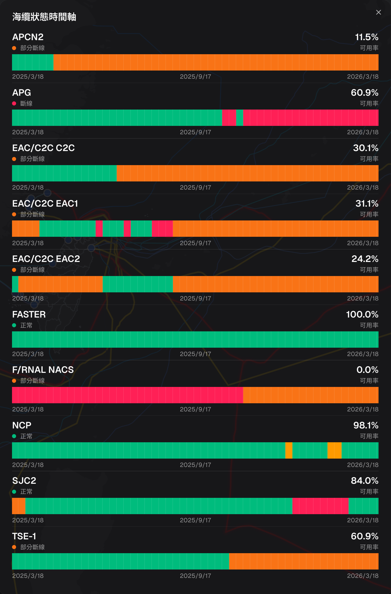
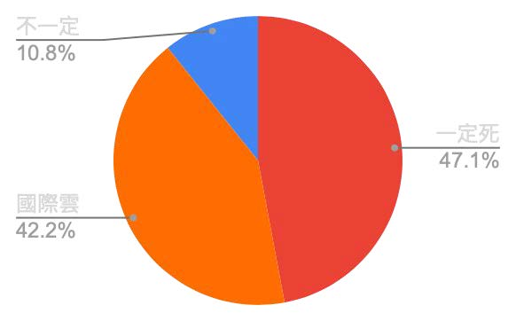
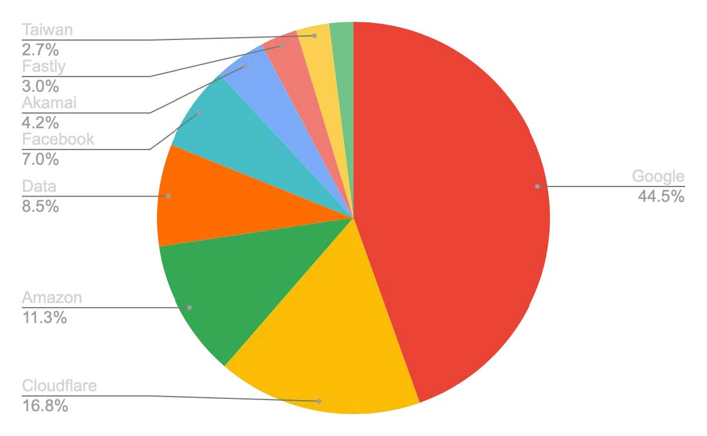

# 海纜斷光會怎樣？認識台灣的國際網路中斷風險
## When Submarine Cables Go Dark: Understanding and Preparing for the Risks of Taiwan’s International Internet Disconnection

### 作者

陳心一 Irvin Chen   
開放文化基金會 Open Culture Foundation ([ocf.tw](https://ocf.tw))  
MozTW, Mozilla 台灣社群 ([moztw.org](https://moztw.org))  

### 更新日期

Published: 2026-03-23  
Last Updated: 2026-03-23

### 誌謝

 
This work was supported by a grant from the [APNIC Foundation](https://apnic.foundation/), via the [Information Society Innovation Fund (ISIF Asia)](https://apnic.foundation/home/isifasia/).

## 摘要

本研究探討當台灣發生大規模國際海底電纜中斷時，日常常用網路服務的可用性風險。透過瀏覽器觀測網站首頁資源要求，追蹤頁面依賴資源的來源，作為風險評估指標。研究聚焦兩項核心議題：

（一）台灣常用網站對境外資源的依賴程度；
（二）台灣常用網站對跨國雲服務境內節點的依賴程度，以及雲端依賴相關的韌性特徵。

本研究發展一套量測的方法框架，將抽象的「海纜斷光的斷網風險」，轉化為具體的服務依賴結構分析，結果可作為政策與產業韌性規劃的基礎。

經檢測 1832 個台灣常用網站，結果顯示，47% 的網站存在境外資源依賴暴露，在海纜斷光情境下，具有較高的直接失效風險。另有 42% 的網站依賴跨國公有雲在台節點資源，其在境外連線中斷時的實際可用性，仍存在高度不確定性。

## 目錄

1. [研究背景](#研究背景)
2. [研究問題](#研究問題)
3. [研究標的與環境](#研究標的與環境)
4. [研究方法](#研究方法)
5. [研究實作與資料處理](#研究實作與資料處理)
6. [研究結果](#研究結果)
7. [研究建議](#研究建議)
8. [研究限制與後續方向](#研究限制與後續方向)

## 研究背景

### 日常網路服務如何依賴國際連線

全球資訊網（World Wide Web，WWW）是台灣社會運作的基礎。

台灣是一個高度數位化的社會，從通訊、物流、商業、媒體、公共及政府運作，生活中的一切，都仰賴網路上的各種數位資訊系統作為基礎。從起床、工作到就寢，人人幾乎無時無刻都盯著手機、電視、電腦、平板等各種螢幕，連結網際網路，存取與交換各種資訊。[ref](https://report.twnic.tw/2025/TrendAnalysis_internetUsage.html)

當你拿出手機，打開某一個 app（例如 Line），收到並回覆一則訊息時，實際上發生了什麼事？

當你點開 Line 時，手機的作業系統會先打開 Line 程式。Line 會告訴手機，他需要讀取某個網址的 Line 主機（伺服器，大型電腦）的內容。

手機的作業系統，會先連結到電信公司的 DNS，查詢 Line 想要連結的目標 IP 位址。接著開始透過 TCP/IP 協定，嘗試連結到目標伺服器，以取得所需資料。

此時訊息先從手機發出，透過無線通訊技術，傳送到最近的行動電話基地台，再從基地台透過實體的光纖網路，送到電信公司機房。

因為 Line 這個服務的主機在國外（日本），此時訊號會再從機房往出國的方向前進。途經許多伺服器後，傳送到台灣的最後一站——台日間某條海底電纜的登陸站（很有可能位於淡海或蘇澳），再透過海底電纜，一路傳送到日本。

訊號抵達日本後，同樣經過登陸站，從海洋回到陸地上，進入當地電信公司機房，再經過一站一站的傳輸，最後傳送到 Line 位於某個雲端業者（例如亞馬遜 Amazon AWS、Google Cloud、微軟 Microsoft Azure…）機房中的 Line 主機上。

最後，Line 的主機處理這個請求後，再將回應，透過反方向的路徑，一樣途經海纜，送回台灣的電信公司網路，再透過行動電話基地台，傳輸回你的手機上，並透過手機的程式，將其處理並顯示出來。

這個再一般不過的流程，都在幾分之一秒內完成。你可能根本沒有察覺，訊息已經經過了數千公里，來回了台灣日本一圈。更甚者早已經過了數萬公里，到了地球的另一端，又從美國或歐洲，回到台灣。

當你打開手機，點開 Line 或任何其他 app、網站的那個瞬間，上述流程已經重複了數十、上百，甚至上千次。

### 台灣作為島國的海纜脆弱性

根據以上說明，我們已經知道，許多我們每天使用的網站、app，其實都依賴於他國的連線。如果沒有國際連線，極大部分的網站與app，有可能都將無法正常運作。

而台灣身為一個島國，我們連結到全球的通訊，超過 99% 都依賴現有的 14 條國際海底電纜傳輸[ref](https://www.cna.com.tw/news/aipl/202501100036.aspx)，因此，海纜的韌性，等同於台灣社會的韌性。

海底電纜一般是數公分直徑的多層纜線，直接放置在海床上（深海處），或埋入海床一至三公尺深度（淺海處），因而在台灣海峽之類水深較淺，人類活動密集的水域，容易因船隻下錨、漁船或抽砂船活動等原因而意外受損。除此之外，另有自然因素（例如地震導致海底山崩），又或者地緣政治相關風險的事故，也是常見的損壞原因。

事實上，根據 [台灣海纜動態地圖（smc.peering.tw）](https://smc.peering.tw/) 網站的可用性統計資料，台灣幾乎無時無刻都有一條以上的海底電纜處於故障狀態。

台灣目前的對外連線，總共有十五條國際海底電纜，連結四個海邊的登陸機房（淡水、八里、頭城、以及枋山），連結台灣與全球的網路。另有十條國內海底電纜，連接金門、馬祖、澎湖、小琉球等離島。[ref](https://moda.gov.tw/major-policies/subseacable/1747)

這十五條國際海纜，共同承擔了台灣連結全球的網路流量。因為網際網路的設計即著重網狀、冗餘、多樣與連通等要素，如果僅有一條或少數海纜發生故障，電信商可調整訊號轉由其他海纜傳輸，因此一般情況下，儘管連線品質有所下降，但你或許不會感覺到有任何差異。[ref](https://ctse.aei.org/beyond-infrastructure-internet-ecosystem-resilience-and-the-public-good/)

然而，由於物理上的硬性限制，一旦多條海纜同時發生故障，就有可能耗盡所有的傳輸冗餘頻寬，開始產生較嚴重的堵塞，或大規模無法連線，進而對社會上的通訊、物流、政府運作以及各類數位服務造成廣泛衝擊。  

### 歷史案例：多條海纜同時故障的影響

這樣的事件，就在近期才剛發生。2025 年 12 月 25 日至 1 月 3 日，台灣西北方宜蘭外海的一系列海底地震，總共造成七條海底電纜故障（接近半數，含 EAC1、SJC2、PLCN、F/RNAL、EAC2、Apricot 等），直到現在（3 月 16 日）尚未完全修復。民間也持續發出網路變慢等意見。

另一重要案例則在二十年前的年底，台灣曾發生過一場史上最為嚴重的大規模海纜故障事件。2006 年 12 月 26 日晚上八點 26 分及 34 分，恆春西南外海發生兩起規模 7 的地震，並引發多次餘震。雖然本島受災相較對輕微，但造成海底大規模山崩，因而損壞當時六條對外海纜中的四條。

此一事故，造成台灣對外的國際通訊嚴重中斷，事件初期，台灣對美國的電話撥通率僅剩 40%，對中國、日本更只有約 10%。不僅台灣受影響，中國、香港、日本、韓國、東南亞各國的國際通訊，也都受到劇烈衝擊。影響國際經貿及金融交易，在境外網路服務方面，Google、Yahoo、MSN、Gmail、維基百科等主要服務，在多國均有大幅中斷。

事發後共有八艘海纜船參與搶修，歷時將近兩個月才完全修復[ref](https://web.archive.org/web/20070217181311/http://www.ofta.gov.hk/zh/press_rel/2007/Feb_2007_r4.html)。聯合國國際減災策略署（ISDR）主任形容此次地震對海底電纜的損害，是現代新型態災難[ref](https://web.archive.org/web/20070210045300/http://news.msn.com.tw/cna/cna_full_text.asp?yy=07&mm=02&dd=08&name=000030)。

上述兩事件，均是因為多數海纜同時發生故障，雖未完全中斷，但仍產生非常嚴重的壅塞及斷線。

而 2023 年初的馬祖斷網事件，則成為一地區對外海纜完全中斷的實際案例。當時馬祖對台灣連線的兩條海纜，在 2023 年 2 月 2 號及 2 月 8 號陸續遭中國漁船損壞，因而導致區域對外的網路與電訊完全中斷，僅剩頻寬極為有限的微波（2Gbps）支援，多數民眾難以上網[ref](https://www.facebook.com/wen1949/posts/pfbid0C1juirBxeTdoaarQnzXpWBdR7C8xodHPJ3Ctrh93kF7hdeU6547KiC8SwRRvBjwfl)，直到三月底，歷經 50 天後，才修復其中一條台馬 3 號海纜，恢復正常連網。

台馬 2 號及 3 號海纜總頻寬為 1Tbps，在 2023 年事件後，台馬微波通訊頻寬擴展至 12Gbps，於 2025 年 1 月 15 日及 1 月 22 日，馬祖再次發生兩條海纜陸續中斷的事故，此時則經由擴增後的微波通訊，則得以維持一定程度的連線能量[ref](https://www.twreporter.org/a/damaged-undersea-cables-raises-alarm-in-taiwan)。

### 衛星能否作為替代方案

2006 年事件初期，中華電信透過調撥中新一號通訊衛星，支援國際電話通訊，在短期間恢復部分國際語音電話可用性。如果現代再次發生同等規模的事故，衛星是否也可以作為替代方案？

衛星的通訊頻寬，跟海纜有極大差距。單條現代海纜的容量約有數十 Tbps，而新的低軌衛星，例如 Starlink，單顆僅有數十 Gbps，約差距一千倍。整個 Starlink 系統的總容量，僅約相當於單個海纜系統[ref](https://opendata.uni-halle.de/bitstream/1981185920/103863/1/1_9%20ICAIIT_2023_paper_4290.pdf)。任何現有的衛星系統，均無法滿足目前台灣連外所需的通訊容量。因此，衛星只能作為政府對外或地區型災難的緊急通訊備援，無法作為服務全國聯外所需的替代方案。

### 為何今日的風險高過 2006

在 2006 事件中，境外連線中斷對社會經貿的影響，主要在於國際電話通訊的中斷，對國際金融交易等族群及特定行業，產生較大影響。境外網路服務的受阻，僅為當時少數網路使用者的困擾。但經過 20 年，網路服務已經是社會運作的基礎，如果再次發生同等規模的事故，除通訊外，勢必會對社會的各方面產生更廣泛的衝擊。

近年，台灣社會對於海纜斷線的討論，多停留在其對「通訊」的阻礙上。諸如跨國通訊服務受阻，如 Line / Messenger / WeChat 等服務，或者 Google、Gmail、Office 365 等雲端或辦公軟體無法使用。社會對於此類事件的認知，離 2006 並不太遠。

### 現有研究的不足與本研究定位

目前關於網路韌性的探討，多半聚焦於基礎設施層面，例如海纜拓樸、路由協定[ref](https://web.cs.ucla.edu/~lixia/papers/04IEEENetwork.pdf),[ref](https://conferences.sigcomm.org/co-next/2007/papers/papers/paper25.pdf)、DNS 系統[ref](https://assets.ctfassets.net/qhzu5l2wyxby/fsS3ZYrpTZKOHJL_EJxRGw/b2d681b0eebb8ee66708c3f94b98f9df/resilience-dns_comnet.pdf), [ref](https://www.internetsociety.org/wp-content/uploads/2021/01/bp-dnsresiliency-201201-en_0.pdf)、或檢視網站所在位置，較少以全面性的方式，探討當一個地區失去對外連線時，日常使用的數位服務，實際會發生什麼情況[ref](https://ctse.aei.org/beyond-infrastructure-internet-ecosystem-resilience-and-the-public-good/)。

### 小結

事實上，因資訊系統作為社會基礎，以及網路服務的架構的複雜性逐年提升，此類事件發生在現代的影響，將會遠遠超過 2006 年的樣貌。

當代台灣社會的各方面，其實都仰賴於資訊系統。除上述顯而易見的通訊軟體、辦公軟體外，各產業與社會部門，如金融、醫療、教育、交通、能源、政府運作……等，任何產業都有內部資訊系統支撐。而這些系統，在失去境外連線的情境下，可用性其實是存疑的。

現在的網路服務架構，已經遠遠超過 2006 年的樣貌。大多的資訊服務系統，架設在某個雲端服務上，實際位置可能分布在不同地區的機房；網站與 app 的架構，也不僅是單純的 HTML 頁面，而使用了許多外部的技術元件，如 CSS / JavaScript 框架，串接各種外部的登入、統計、金流、資料、AI 等等功能的 API。因此，一個看似國內的服務，實際上可能存在不同國家的機房，需使用不同國家的資源，才能正常運作。

因為上述兩項因素，當海纜斷光可能會對社會的各方面產生廣泛衝擊。可能會有許多企業或部門的內部系統意外的停擺，又或者國內的網站或 App，因沒辦法連結到境外的所需資源，因而也停止運作。因而產生超過預期的衝擊。

如果因為海纜大規模斷線，導致短時間內，許多部門的資訊系統同時意外失效，將會對社會運作產生極大衝擊。且屆時在沒有國際網路連線的狀態下，要修復這些資訊系統，將會變成極為困難的事情。

既然我們並未了解「海纜大規模斷線」的實際影響，我們就無法對其做出準備。因此，本研究希望能透過發展一套測試技術框架，以衡量在海纜大規模中斷，台灣失去境外連線的情境下，各類數位服務的實際表現。

本研究聚焦於此缺乏系統性議題：當一個高度仰賴國際網路的地區（如台灣），失去其對外海纜連線，亦即失去國際網際網路連線時，主要數位服務的運作、退化或失效的程度。

我們想要了解，台灣常用的數位服務，對於境外依賴有多深，以至於一旦台灣對外連線中斷，可能有多少面臨失效。建立一個可量測的方法，才能回答「海纜斷光會怎樣」，把抽象的「海纜斷光」，轉化為可拆解、可準備的具體問題。

## 研究問題

當高度仰賴國際網路的島嶼型國家（例如台灣），失去其對外海纜連線，亦即失去國際網際網路時，其國內主要數位服務運作、退化或失效的程度。

本研究希望發展一套方式，針對資訊服務運作時所需的境外元件——例如 CDN、第三方 API、雲端平台、與外部程式庫，進行系統化的測試統計，以描繪出社會常用的數位服務，在境外網路隔離情境下的依賴結構與潛在可用性風險。

本研究將為政府、產業與社會提供更具體的證據與分析基礎，理解境外連線中斷的系統性衝擊規模，以進一步作為制定數位服務與社會基礎部門韌性提升的策略基礎。

本研究關注兩項核心議題：

1. 網站對境外資源的依賴程度  
2. 網站對跨國雲服務在台灣節點的依賴程度，以及此類依賴在境外連線中斷情境反映的韌性意涵

需要強調的是，本研究並不直接驗證網站完整後端架構或雲端服務之控制面依賴，而是以程式化瀏覽器檢視網站載入過程中可觀測的資源請求作為分析基礎，將資源來源分布視為依賴結構的代理指標。

以下為本研究回答的三個具體問題：

1. 在「台灣對外連線大幅受阻或中斷」的情境下，**台灣人常用網站中，有多少比例在首頁層級會立刻受影響？**
2. 風險是否**集中在特定雲端服務生態**？
3. 不同屬性的網站（例如`.gov.tw`政府網站、`.edu.tw`教育網站、與一般服務），其**本地韌性是否存在系統性差異？**

## 研究標的與環境

本研究整理出一份台灣的高流量網站，作為測試目標。清單同時包含台灣本土的服務，以及台灣常用的國際服務。

研究標的不限於「台灣網站」，而是「台灣人會用的網站」，故此清單中亦包含 Google、Gmail 等國際服務。

本研究測試的標的是「網站」（Web），不直接等同 App 可用性。（開放文化基金會目前另有相關計畫，針對 App 的連線韌性進行研究）

### 建立常用網站清單

目前尚無「台灣人常用網站」的權威清單，因此本研究整併以下多個來源，整理出不重複的測試網站清單。

- [Tranco List](https://tranco-list.eu/) - 全球前 100 萬網站排名，取 .tw 的網站。
- [Cloudflare Radar](https://radar.cloudflare.com/) - Cloudflare 的台灣流量排名（前 100 名）
- [AhrefsTop](https://ahrefstop.com/websites/taiwan) - Ahrefs 的台灣 Organic Search 流量排名（前 100 名）
- [SimilarWeb](https://www.similarweb.com/top-websites/taiwan/) - SimilarWeb 的台灣網站流量排名（前 50 名）
- [Semrush](https://www.semrush.com/trending-websites/tw/all) - Semrush 的台灣網站流量排名（前 100 名）

清單更新於 2026 年 1 月 6 日，共 2109 個網站 [ref](https://github.com/irvin/top-traffic-website-list-taiwan/blob/553b50a143f52a0c189afbee6c335e846aace004/merged_lists_tw.json)，並依照流量高低先後排序，可用以衡量特定網站重要性。

相關清單與 script 開源於 [top-traffic-website-list-taiwan](https://github.com/irvin/top-traffic-website-list-taiwan/) 專案。

除以上 2109 網站外，本研究另加入 12 個手動指定測試站點（例如 OCF、SITCON、g0v 等）以涵蓋社群關注個案。[ref](https://github.com/irvin/web-resilience-test/commit/6f238af285d2db9be1b59134996a2a60793e5817)

### 測試環境

本研究使用一般台灣常見的家用網路環境進行測試，包括以下屬性：

- 一般家用中華電信光世代 500M/500M 網路
- 測試位置：新北市中和區、台北市中正區
- DNS：168.95.1.1
- 相關環境資訊記錄在測試 log 中，方便後續比較或重現。

## 研究方法

### 方法定位與指標定義

本研究採用「以網站資源請求行為為基礎的依賴暴露分析」方法。

由於網站後端架構、資料傳輸、控制面依賴、與雲端內部運作機制，無法直接從外部觀測，本研究不試圖直接驗證完整系統依賴關係，而聚焦於網站前端可觀測的網路資源請求行為（requests），並據此建立可操作化指標。

具體而言，本研究定義以下兩項核心指標：

1. **境外資源依賴暴露（Foreign Dependency Exposure）**  
   指網站 requests 中是否存在境外資源請求，用以衡量網站在資源取得層面對境外網路的依賴暴露。

2. **跨國雲在台節點依賴暴露（Cloud Local Endpoint Exposure）**  
   指網站 requests 中是否存在跨國雲服務在台灣節點的請求，用以衡量網站是否直接位於、或對跨國雲在地節點有依賴暴露。

此兩項指標，反映的是網站在前端資源層的「依賴暴露結構」，而非完整系統架構或實際故障行為。

### 指標與風險分類框架

在海纜中斷情境下，上述兩指標的意涵如下：

- 存在境外資源依賴暴露：表示網站首頁載入直接依賴境外資源，於境外連線中斷情境下具有較高的直接失效風險。
- 存在跨國雲在台節點依賴暴露：表示網站首頁載入，仰賴跨國雲服務在台灣節點提供之資源，其可用性取決於雲端控制面、來源架構與快取持續能力，因此具有較高的不確定性。

因此，本研究進一步將網站依據兩項依賴的暴露，區分為三種類型：

1. **存在境外資源依賴暴露**  
   網站直接依賴境外資源；一旦國際連線中斷，較可能立即受影響，屬於直接風險最高的類型。

2. **無境外資源依賴暴露 × 存在跨國雲在台節點依賴暴露**  
   網站無直接連向境外資源，但仰賴跨國雲在台節點提供的資源。此類網站可能具備一定程度的在地落點，但其實際可用性仍取決於雲服務的可用性因素，因此屬於「表面具在地韌性、實際仍可能有跨境依賴」的類型。

3. **無境外資源依賴暴露 × 無跨國雲在台節點依賴暴露**  
   代表網站前端可觀測資源無境外來源依賴，也無跨國雲在台節點依賴。就本研究之觀測範圍而言，此類網站呈現相對較高的本地運作可能性，但仍不代表其完整系統在境外網路中斷時，必然持續可用。

## 研究實作與資料處理

本研究所使用的研究工具包含以下專案：

- [top-traffic-website-list-taiwan](https://github.com/irvin/top-traffic-website-list-taiwan) 收集與整理台灣常用網站
- [web-resilience-test](https://github.com/irvin/web-resilience-test) 網站韌性測試工具
- [web-resilience-test-profile](https://github.com/irvin/web-resilience-test-profile) 編譯上述測試結果成為靜態網頁
- [resilience.ocf.tw](https://github.com/ocftw/resilience.ocf.tw) 公開之測試結果查詢網站

### 擷取測試資料

本研究開發一 [web-resilience-test](https://github.com/irvin/web-resilience-test) 工具，針對上述研究標的網站的首頁，運用程式化的 headless 瀏覽器進行逐站開啟，並紀錄其頁面載入時的所有資源連線。

接著，本工具將針對每一項資源，透過 IPinfo / header 資訊 / ping RTT，判斷其實際地理位置及邏輯位置（例如來自哪一個公有雲服務）。

最後，本工具針對所有測試結果進行統計，整理成結果數據表格。

#### 單一網站測試流程
  
[`no-global-connection-check.js`](https://github.com/irvin/web-resilience-test/blob/main_w_tw_result/no-global-connection-check.js) 用在單一網站的測試，流程如下：

  1. 前置初始化
     - 環境初始化，並載入排除網域清單
     - 正規化測試目標網址（如補完 `https://` 等）

  2. 載入頁面與蒐集請求
     - 運用 Playwright 套件的 headless Chromium 模式打開測試網站
     - 監聽 `request` 以收集所有資源 request 的相關資料（包含 headers 資訊）

  3. 重試機制與錯誤處理
     - 如發生 4xx 錯誤，則視為測試失敗，並紀下相關資訊
     - 如果遭遇其他錯誤，則按照下列順序，個別改用不同瀏覽器模式及針對不同網址進行測試：  
       - headless 瀏覽器 / 非 headless 瀏覽器
       - 網址前方加入 `www.` / 移除網址前方的 `www.`
     - 如經過上述四種變化，仍然遭遇錯誤，則紀錄相關資訊並跳到下一個測試網站

  4. 清理 request 資料
     - 針對個別網站的 request 資訊，進行以下清理
       - 過濾掉所有的 `blob:` 請求
       - 套用 adblock domain 清單，以過濾廣告等不必要資源
       - 根據 hostname 整理出不重複連線伺服器清單

  5. 判定網域位置
     - 針對前述 hostname 清單，呼叫 IPinfo API，取得其位置資料
     - 如果查詢的資料顯示 `country=TW`，則紀錄為境內連線
     - 若查詢的結果顯示 `country`非`TW`，則根據連線的 ASN，判定是否來自國際公有雲節點（Google / Cloudflare / Amazon / Fastly / Akamai / Microsoft），並進入下一步的進階判定。
       - 本研究同時參酌測試網站的 request 資料，建立公有雲的對應 ASN 清單 [cloud_providers_tw.json
  ](https://github.com/irvin/top-traffic-website-list-taiwan/blob/16dbb8bbdeb5e27397961556c7aa9ae54767742d/cloud_providers_tw.json)，除供判定使用外，也同步開源供其他研究與專案參考。

     a. Header 判定
       - 檢查連線的 response header，是否包含 `cf-ray`、`x-amz-cf-pop`、`x-served-by` 等雲端系統已知的位置標記。

     b. RTT 判定
       - 若無法從 header 擷取到明確的位置資訊，則針對該資源進行 `ping` 5 次，取最小 RTT。如果 `RTT < 15ms`，則將其視為台灣境內資源。

  6. 分類資源，建立韌性指標數據
     - 根據上述資訊，將每個資源域名分為以下四類之一：`domestic/cloud`、`domestic/direct`、`foreign/cloud`、`foreign/direct`
     - 計算網站的所有四個類型的 request 總數，並將結果儲存為 `test-results/<site>.json` 檔案。

  7. 錯誤處理
     - 如上述流程中發生錯誤，則將相關資訊紀錄至 `test-results/_error/<site>.error.json` 檔案。
     - 測試流程中，常見的錯誤類型包含：
       - `Cloudflare Challenge`
       - `HTTP 4xx Error`
       - `Timeout`

#### 批次測試流程
  
[`batch-test.js`](https://github.com/irvin/web-resilience-test/blob/main_w_tw_result/batch-test.js) 會呼叫上述單一網站測試工具，針對測試目標列表批次執行，並輸出結果統計資料成 `test-results/statistic.tsv` 檔案。

從上述批次資料中，我們即可繼續進行統計分析，得知整體的網站對境外依賴比例，及個別資源的韌性狀態。

### 建置個別網站查詢頁面

本研究使用 [web-resilience-test-profile](https://github.com/irvin/web-resilience-test-profile) 工具，將個別測試結果編譯成個別靜態頁面，建立 [https://resilience.ocf.tw/](https://resilience.ocf.tw/) 網站，供公眾自由查詢個別網站的韌性狀態。（例如 [海纜斷掉時，ocf.tw 會動嗎？](https://resilience.ocf.tw/web/ocf.tw/)）。

本工具從測試到編譯出結果頁面，在兩千個網站的數量級時，如以預設值平行測試 4 個網站，再平行編譯 8 個網站，需時約 30~60 分鐘。目前最新的測試結果，已公布於 [web-resilience-test-result](https://github.com/irvin/web-resilience-test-result) 專案，以及 [resilience.ocf.tw](https://resilience.ocf.tw/) 網站。

## 研究結果

### 研究資料快照

本研究共測試了 2109 個網站，其中 1832 個網站完成測試。

- 測試日期：2026 年 1 月 15 日
- 測試網站清單： 
  - [merged_lists_tw.json@eaa7ba4](https://github.com/irvin/top-traffic-website-list-taiwan/blob/eaa7ba4275d66e54391879f0c39cd3058f71dda6/merged_lists_tw.json) 
  - [manual_curated_list_tw.json@60285a2](https://github.com/irvin/web-resilience-test/blob/60285a2fb442fbc74d3752288d5a449ec53b9092/manual_curated_list_tw.json)
- 測試結果總表： [statistic.tsv@aa52e083](https://github.com/irvin/web-resilience-test-result/blob/aa52e083f0e0734f05b8b637311f12d0cb900f4b/statistic.tsv)

### 整體結果

在本研究的分類框架下，47% 的網站呈現境外資源依賴暴露，顯示其在海纜斷光情境下，**具有較高的直接失效風險**；另有 42% 的網站雖未觀測到境外資源依賴，但依賴跨國公有雲在台節點提供的資源，其實際可用性**具有高度不確定性**。整體而言，共有 89% 的網站屬於需進一步關注的高風險或高不確定性類型。

### 結果說明

第一個類型的網站，網站本身就來自境外，或有呼叫境外資源，故存在高度失效風險。

第二類網站雖未直接連向境外資源，但其所擷取的資源，來自跨國公有雲在台灣的節點。這些節點在網路拓樸上雖位於台灣，但其控制面、來源架構、身份驗證或快取持續能力，仍可能依賴境外系統。因此，本研究將此類網站視為「雖具在地落點但可用性不確定」的類型。

### 國際公有雲依賴狀態分析

統計所有測試網站對於來自「國際公有雲在台灣節點」的資源依賴度，我們發現以下數據：

- Google Cloud Platform 境內節點：共 710 個網站
- Cloudflare 境內節點：共 240 個網站
- Amazon Web Services 境內節點：共 117 個網站
- Akamai 境內節點：共 94 個網站
- Fastly 境內節點：共 33 個網站
- Azure 境內節點：共 3 個網站

1832 個網站中，共有 710 個網站取用來自 GCP 境內節點的資源，占比接近四成（38.7%）。亦即，如果 GCP 等公有雲服務，在境外網路中斷時，境內節點無法維持正常運作，將會造成非常高的衝擊。

#### 國際公有雲資源位置

我們另外檢視所有網站國際公有雲資源的境內外位置分佈，發現以下結果：

| Company Name | Websites (domestic node) | Websites (foreign node) |
|--------------|--------------------------|--------------------------|
| Google LLC | 1423 | 30 |
| Cloudflare, Inc. | 659 | 294 |
| Amazon.com, Inc. | 409 | 231 |
| Akamai Technologies, Inc. | 351 | 9 |
| Fastly, Inc. | 121 | 213 |
| Microsoft Corporation | 6 | 167 |

以 Google 雲端為例，資源來自其境內節點的佔比居然高達 99.3%，境外節點僅佔約 0.7%。此結果顯示 CDN 等相關技術發展，對於資料在地化（Data Localization）的實際助益。另外也表示，這些在台節點保存鏡相資源之持續可用時間，將是境外擁塞或斷線時，影響一般網站的服務之存續狀態的關鍵要素。

對於境內資源比例較低的公有雲服務，可進一步評估其是否具備在國內建立完整鏡相備援、快取持續與應變運作機制的可行性。

### 資源位置／雲平台依賴狀態統計

以下統計以「網站是否至少出現一項該類資源請求」為主，數字並非 request 數量。

| 單位：網站數及採用率 | 境內 | 境外 | 總計 |
|------------------|-----|-----|-----|
| 公有雲 | 1668 (91%) | 795 (43%) | 1724 (94%) |
| 非雲 | 1044 (57%) | 191 (10%) | 1122 (61%) |
| 總計 | 1769 (97%) | 862 (47%) |  |

分析台灣常用網站之資源依賴狀態，統計對 [境內／公有雲] [境外／公有雲] [境內／非雲] [境外／非雲] 的個別比例，結果如下：

94% 的網站依賴國際公有雲資源，其中有 91% 的網站依賴境內公有雲資源，43% 網站依賴境外公有雲資源。47% 的網站有境外資源依賴。

另外，本研究也發現只有 3% 的網站（包含跨國服務）「完全僅用到境外資源」，表示 CDN 等相關技術發展，對於資料在地化（Data Localization）與提升網路韌性的實際助益。

### 資源來源分布

如果將所有 request 根據 ASN 進行統計排序，我們發現網站依賴資源高度集中於大型供應商，其中超過 5% 的來源有 Google、Cloudflare、Amazon、中華電信及 Facebook。

其中，Google 佔比最高，達 40.9%，Cloudflare 佔比 15.4%，Amazon 佔比 10.4%。來自 Google 的主要資源有 GTM、而 Cloudflare 提供的 JavaScript CDN 與 WAF 等基礎架構與服務，構成現在網路服務韌性的關鍵環節。

| name | count | percent |
|------|-------|---------|
| Google | 6,380 | 40.9% |
| Cloudflare | 2,407 | 15.4% |
| Amazon | 1,618 | 10.4% |
| Data Communication (CHT) | 1,213 | 7.8% |
| Facebook | 1,001 | 6.4% |
| Akamai | 598 | 3.8% |
| Fastly | 433 | 2.8% |
| Taiwan Academic (TANet) | 388 | 2.5% |
| Microsoft | 285 | 1.8% |
| Oracle | 95 | 0.6% |
| New Century | 93 | 0.6% |
| Yahoo | 63 | 0.4% |
| Automattic | 59 | 0.4% |
| Incapsula | 56 | 0.4% |
| Zenlayer | 51 | 0.3% |
| Sony | 47 | 0.3% |
| Baidu | 46 | 0.3% |
| internet content provider (yahoo jp) | 42 | 0.3% |
| Byteplus | 34 | 0.2% |
| Magnite | 33 | 0.2% |
| AboveNet | 25 | 0.2% |
| Datacamp | 23 | 0.1% |
| SHOPEE | 23 | 0.1% |
| Yuan-Jhen Info | 22 | 0.1% |
| Gamania | 21 | 0.1% |
| Tencent | 21 | 0.1% |
| Zhejiang Taobao | 20 | 0.1% |

### 公共機關整體風險

分析政府網站與教育機構的韌性狀態，我們發現，相較於整體狀態（47%），政府與教育網站的斷線風險相對較低：

- 測試網站中含 200 個政府網站（`.gov.tw`），其中僅 19 個有境外連線，比例為 10%。
- 測試網站中含 219 個教育網站（`.edu.tw`），其中僅 36 個有境外連線，比例為 16%。

此結果顯示，政府與教育網站在資源層面上的境外依賴相對較低，反映公部門與學術網路環境在本地可用性上可能具較高基礎，但其完整服務韌性仍需進一步檢驗後端依賴與使用流程。

| 類型 | 測試網站數量 | 存在境外連線數量 | 比例 |
| --- | --- | --- | --- |
| 政府網站 | 200 | 19 | 10% |
| 教育網站 | 219 | 36 | 16% |
| 全部 | 1832 | 862 | 47% |

<!-- FIXME: add 失敗樣本分析 -->

## 研究建議

針對本研究的發現，我們歸納出政策面與技術面等以下建議，以提高台灣整體數位服務的韌性：

綜合本研究發現，台灣常用網站的主要風險，並非來自少數完全位於境外的服務，而廣泛存在於對境外資源、與跨國公有雲在台節點的依賴結構中。因此，提升韌性的策略不應限於聚焦「服務是否在台灣」，而應進一步檢驗其資源供應鏈、雲端控制面、與關鍵使用流程，是否具備本地持續運作能力。

<!-- FIXME: add 政策建議分眾： 政府採購與監管、關鍵基礎設施營運者、網站開發者 -->

### 政策面建議

1. 支持相關研究，持續觀測常用與關鍵服務的韌性狀態，並常態揭露整體與個別結果。
2. 支持後續研究，以開發更深入的韌性測試框架及流程，針對如登入、交易、瀏覽、搜尋等使用流程，進行進一步深入可用性測試
3. 針對 Google、Cloudflare、Amazon、Akamai 等境內高度依賴的國際公有雲在台節點系統，提供政策要求與預算支持，驗證並提升其境外斷線時的服務可用性。
4. 政策要求與預算支持，降低境內關鍵服務對境外資源的依賴度，以提高其本地韌性。
5. 鼓勵或要求境內關鍵服務制定本地備援機制或復原計畫，並定期進行斷線演練。
6. 將本地可用性驗證，納入政府與公共服務採購及驗收條件。

### 技術面建議

7. 針對 Google、Cloudflare、Amazon、Akamai 等高度關鍵的國際公有雲在各地之節點，應制定相關之網路障礙備援計畫，並進行定期演練。
8. 網站製作者應考慮使用境外資源的韌性風險，在呼叫框架時，可優先採有提供境內節點之 CDN 服務，或建立 fallback 機制，在函式庫載入失敗時切換到本地資源，以降低境外連線中斷時的影響。
9. 服務開發者，可針對服務之關鍵要徑（如登入、結帳等），優先進行資料在地化，以改善其韌性並提升服務品質。

## 研究限制與後續方向

1. 本研究以網站連線請求 (requests) 的來源位置作為主要觀測對象，未直接對請求進行完整路徑分析（例如 traceroute）。本研究未透過 traceroute 或使用 VPN 境外跳板，進行實際路徑或他地路徑分析，故無法確定目前取用之境內資源與頁面，是否屬於 anycast 或 CDN 節點。

2. 本研究所衡量之「境外依賴」與「雲端依賴」，均屬於瀏覽器前端（front-end）資源層之可觀測依賴暴露，並不等同於網站完整後端架構之實際依賴關係。就算前端觀測到的資源都位於境內，其後端資料庫存取、API、或任何其他後端服務，仍可能依賴境外資源或服務。故不能將測試結果中 11% 之「前端資源都位於境內與非國際公有雲」的網站，認定為「在境外網路斷線時一定可用」。

3. 網站資源與網頁置於跨國雲服務在台灣節點，並不代表該服務在海纜中斷時必可獨立運作。其實際可用性仍可能受到以下（不限於）因素影響：
   - 控制介面（control plane）是否依賴境外資源
   - 資料來源（origin）是否位於境外
   - 快取命中率（cache hit ratio）與快取持續時間
   - 身份驗證與 session 機制
   - 其他可能影響可用性的因素

4. 本研究未進行實際「海纜中斷模擬」的故障注入測試（即透過 VPN 或 DNS 等方式，模擬境外資源無法存取的環境），且本研究之目的為針對大量網站作一概括性測試，故採用依賴結構推估潛在風險，並未直接操作並觀察服務在斷線情境下的實際退化行為。

5. 本研究以網站首頁為測試目標，未涵蓋登入、交易、瀏覽、搜尋等完整使用流程，因此本結果應視為「初始可用性」評估指標。

後續研究可進一步結合下述方向，以建立更完整的數位服務韌性評估框架。
- 模擬故障情境（運用技術手段，例如 VPN 或 DNS 等方式，模擬境外資源無法存取的環境），配合使用者任務導向（如登入、交易、瀏覽、搜尋等完整使用流程）測試，觀察實際可用性
- 針對常用雲端服務，測試分析其架構（控制介面、資料來源、快取預設設定、身份驗證機制…等）之韌性
- 使用 traceroute 分析資源之完整路徑
- 分析常見前端函式庫與框架（如 jQuery、bootstrap、tailwind、react、vue）的使用率與節點分佈，確認是否存在多重網站依賴的境外服務等單點故障風險。
- 分析不同資源種類（document、script、image、xhr、font、stylesheet）間是否有依賴差異
- 分析不同類型網站（新聞、電商、社群、搜尋引擎等）間的韌性差異
- 鑑別「高流量但低韌性」的高風險網站
