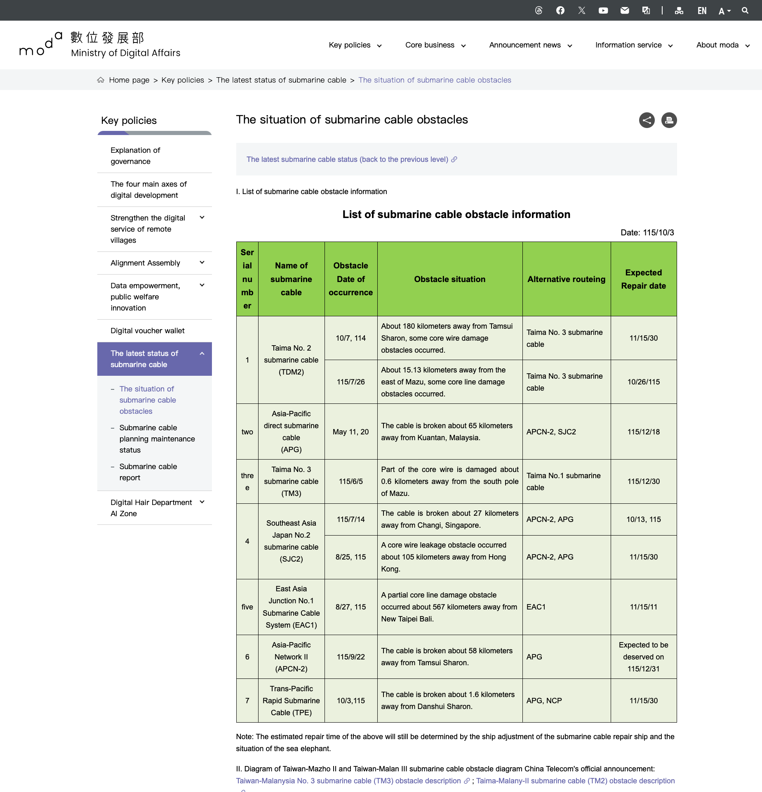
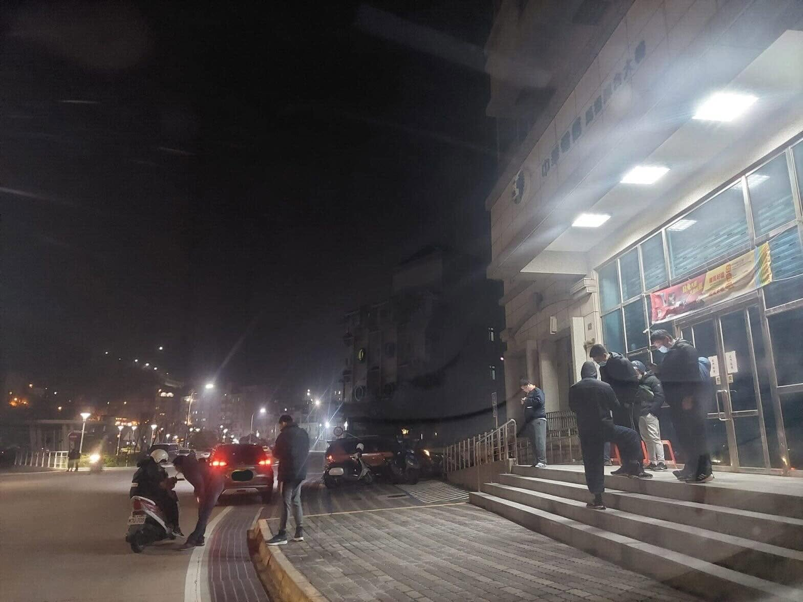
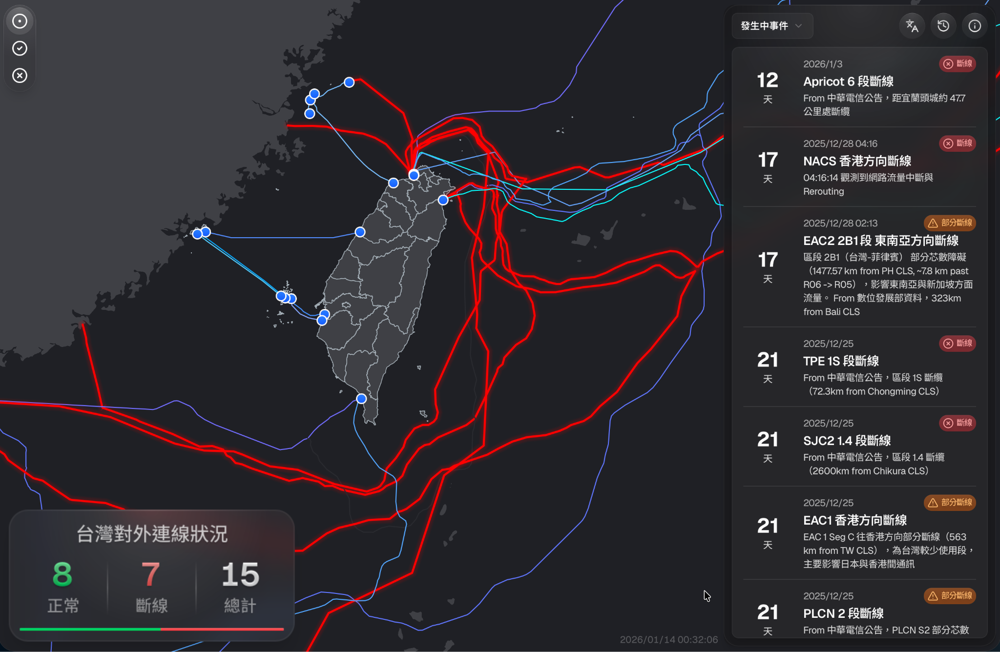
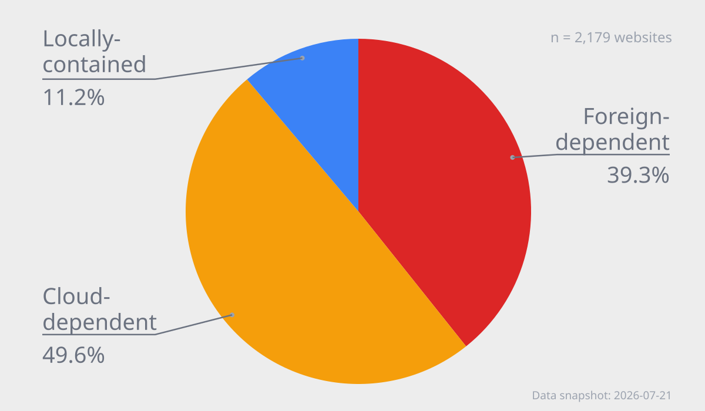
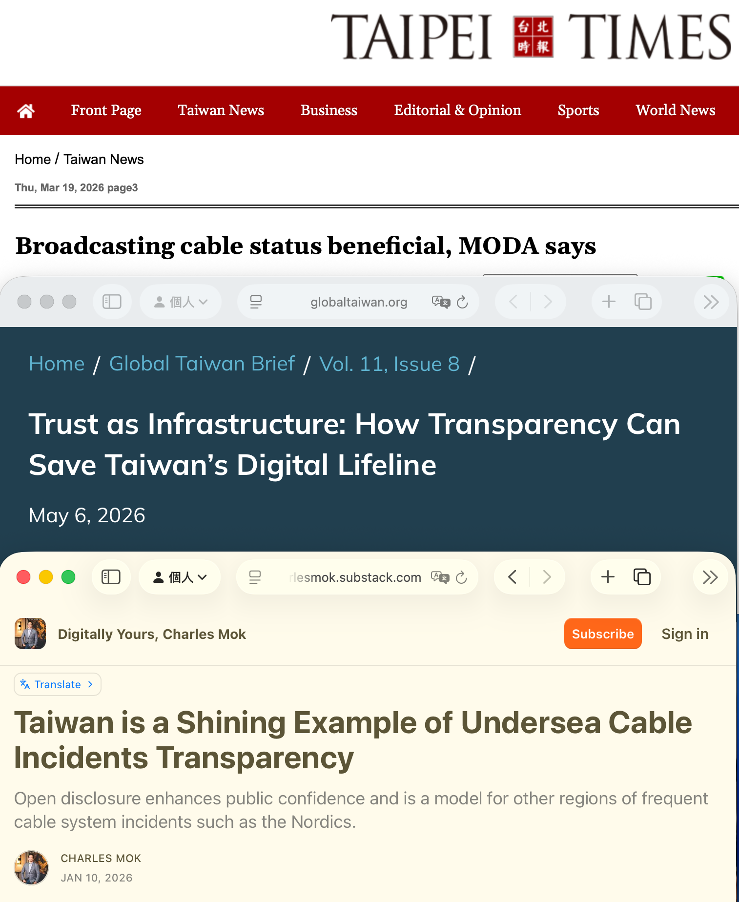

<!-- _class: invert lead-slide -->

## When Submarine Cables Go Dark
# From Matsu's Outage to Public Cable Data

<a href="https://moda.gov.tw/major-policies/subseacable/fault/1749">MODA cable disruption table</a>, 3 Oct 2026. English machine translation of the original Chinese page.

<!--
Time: 1:00 (60 seconds).

Hello everyone. I'm Irvin Chen from the Open Culture Foundation and the Mozilla Taiwan Community.

I want to start with this table from Taiwan's Ministry of Digital Affairs, or MODA. It lists cable disruptions, when they happened, alternative routes, and expected repair dates. The ministry has published this information since September 2025.

That might sound ordinary. But cable faults used to be difficult for the public to follow. Taiwan is now one of the few places that publishes this level of detail. So my question today is: why did this table become public? To answer that, I want to take you back to Matsu.

Sources (reference only, not spoken):
MODA, cable disruption status page. The screenshot is an English machine translation of a table dated 3 Oct 2026.
https://moda.gov.tw/major-policies/subseacable/fault/1749
Taipei Times, "Broadcasting cable status beneficial, MODA says," 19 Mar 2026. Reports the September 2025 launch and MODA's "one of the few countries" description.
https://www.taipeitimes.com/News/taiwan/archives/2026/03/19/2003854094
-->

---

<!-- _class: invert matsu-slide -->

## When Both Cables Failed

- **Matsu, 2023:** two cables failed six days apart
- Microwave backup: only **2.2 Gbps** at first
- Internet service was severely limited for about **50 days**

Photo: <a href="https://www.facebook.com/wen1949/posts/1139994237492633/">Matsu outage post</a>. Capacity: <a href="https://www.cht.com.tw/zh-tw/home/cht/messages/2023/0216-1600">Chunghwa Telecom</a>.

<!--
Time: 2:00 (120 seconds).

Matsu is a group of Taiwanese islands near China. Around 13,000 people live there, and many businesses serve visitors.

In February 2023, the two cables linking Matsu and Taiwan failed six days apart. Vessel activity was investigated, but the exact circumstances remain uncertain.

A microwave backup provided 2.2 gigabits per second at first, far less than normal demand. Matsu was not completely offline, but ordinary internet access became painfully slow. Chunghwa Telecom opened free Wi-Fi at local offices. In this photo, people are outside one of those offices at night, trying to connect.

For around fifty days, the disruption affected daily life and businesses that relied on online communication. For tourists, a trip without a usable connection might sound like a digital detox. For residents, it was not a holiday.

The incident woke up many of us in the internet community. We often discuss clouds and data centers, but rarely the cables beneath the sea.

Matsu made the risk concrete. The question was no longer just how many cables were damaged. It was: can people still use the services they need? And what should we prepare before a larger outage?

But to prepare, we first needed to understand what was happening. That information was surprisingly hard to find.

Sources (reference only, not spoken):
Chunghwa Telecom, announcement on cable repairs and fee reductions, 16 Feb 2023. Confirms the 2 and 8 Feb failures, 2.2 Gbps initial microwave capacity, and free Wi-Fi at local offices.
https://www.cht.com.tw/zh-tw/home/cht/messages/2023/0216-1600
The Reporter, report on Taiwan's response to damaged submarine cables, 12 Feb 2025. Describes approximately 50 days of disruption in Matsu in 2023 and the investigated vessel activity.
https://www.twreporter.org/a/damaged-undersea-cables-raises-alarm-in-taiwan
Photo source supplied with the image:
https://www.facebook.com/wen1949/posts/1139994237492633/
-->

---

<!-- _class: invert map-slide -->

## Making Cable Status Visible

- g0v's Digital Resilience Hackathon brought people together
- A community map made cable faults easier to follow
- On 14 Jan 2026, it showed **7 of 15** connections disrupted

<a href="https://smc.peering.tw/">smc.peering.tw</a> Original interface, captured 14 Jan 2026

<!--
Time: 2:00 (120 seconds).

After Matsu, Taiwan's technical community and civil society asked what we could do. At g0v's Digital Resilience Hackathon, we began making the problem understandable to the public.

One result was this submarine cable map, built by a community member known as seadog007. It combines cable information with incident updates in a form people can explore. You can visit it at smc dot peering dot tw. It gave the community a shared view of a subject that had been hard to discuss.

This screenshot was captured on 14 January 2026. It shows seven of fifteen connections marked as disrupted. Several faults followed earthquakes off northeastern Taiwan from late December to early January. The seven entries shown here do not all have to share the same cause. What matters for this story is that anyone could now see the scale of the problem and ask better questions.

The 2006 Hengchun earthquakes damaged four of Taiwan's six international cables at the time. Today we rely on online services much more. Seeing cable status is a first step. We also need to know what an outage would mean for those services.

Sources (reference only, not spoken):
Community project and source code: https://smc.peering.tw/ and https://github.com/seadog007/smc.peering.tw
This repository's report/en.md, historical incidents section. It distinguishes six cables damaged by the 2025-26 earthquakes from the seven connections marked disrupted in this screenshot.
-->

---

<!-- _class: invert result-slide -->

## What Still Works?

If international links failed, what could users still reach?

- **2,179 homepages** tested (21 July 2026)
- **39.3%** requested resources from abroad
- **49.6%** used local nodes of global clouds or CDNs
- **88.8%** warrant further testing, not a failure prediction

Research: <a href="https://resilience.ocf.tw/web/report/en">resilience.ocf.tw/web/report/en</a> Supported by the <a href="https://apnic.foundation/home/isifasia/">APNIC Foundation's ISIF Asia program</a>.

<!--
Time: 3:00 (180 seconds).

The map helped us see which cables were damaged. But I had another question: if we lost major international links, which websites would still be usable? As a website engineer, I know a page that looks local can still load scripts, fonts, or other resources from abroad.

With support from the APNIC Foundation through ISIF Asia, we tested the homepages of 2,179 websites commonly used in Taiwan. We opened each homepage in a browser and recorded the resources it requested. Then we classified the observable dependencies.

About 39 percent were foreign-dependent: we observed at least one request to a resource outside Taiwan. If international connectivity were lost, that resource would face direct risk.

Another 50 percent were cloud-dependent. We did not observe a foreign request from their homepages, but they used local nodes of multinational cloud providers or content delivery networks. Those local nodes might keep working, or might depend on control systems and services abroad. We cannot tell from a homepage test alone.

The remaining 11 percent were locally contained by this front-end measure. That is the smallest group on the chart, but even those sites might depend on foreign back-end services that our test could not see.

In total, 88.8 percent of the tested sites warrant more investigation. Please don't read that as a prediction that 88.8 percent will go offline. It is a map of visible dependencies and uncertainty, not a live outage simulation.

The practical next step is to test the functions people actually need, not just the homepage: logging in, making payments, getting information, and reaching emergency services. The full methods and results are at resilience dot O-C-F dot T-W slash web slash report.

Sources (reference only, not spoken):
This repository's report/index.md and report/en.md, "When Submarine Cables Go Dark: Understanding and Preparing for the Risks of Taiwan's International Internet Disconnection," results and limitations sections.
Chart: overall-result.en.svg, using the 21 July 2026 data snapshot. The combined share is calculated from site counts before rounding individual category percentages.
Research report: https://resilience.ocf.tw/web/report/
Funding: https://apnic.foundation/home/isifasia/
-->

---

## Public Information Changed the Conversation

- Civic work helped bring cable faults into public view
- [Charles Mok](https://charlesmok.substack.com/p/taiwan-is-a-shining-example-of-undersea) warned that information gaps let rumors spread
- [MODA](https://www.taipeitimes.com/News/taiwan/archives/2026/03/19/2003854094) says verified updates help the public understand the situation

**Clearer risks make it easier to prepare without panic.**

<!--
Time: 1:30 (90 seconds).

Let's return to the table we started with. Matsu raised a public question. The community map made incidents visible. Our research asked what those incidents might mean for online services. Together, these efforts moved the conversation from vague fear to specific questions.

Did the map alone cause the government to publish its table? We cannot know. Charles Mok also points to false rumors in 2025. A Global Taiwan Institute article credits the civic map with pushing disclosure. MODA began publishing verified cable status that September, saying it wanted the public to understand what was happening.

That response matters. Open information gives us something concrete to discuss: which cable is affected, what backup exists, and what still needs testing. In my view, the clearer the risk and its consequences, the easier it is to prepare without panic and push for practical resilience work.

Sources (reference only, not spoken):
Charles Mok, "Taiwan is a Shining Example of Undersea Cable Incidents Transparency," 10 Jan 2026:
https://charlesmok.substack.com/p/taiwan-is-a-shining-example-of-undersea
Liu I-chen, Global Taiwan Institute, "Trust as Infrastructure," 6 May 2026. Attributes a role to the civic map; this is the author's assessment, not evidence of MODA's internal decision process:
https://globaltaiwan.org/2026/05/trust-as-infrastructure/
Taipei Times, "Broadcasting cable status beneficial, MODA says," 19 Mar 2026. Reports MODA's stated purpose and September 2025 launch:
https://www.taipeitimes.com/News/taiwan/archives/2026/03/19/2003854094
Image: screenshots of the three articles above, compiled for this slide.
-->

---

## Contact

- Check English report and data at [`resilience.ocf.tw/web`](https://resilience.ocf.tw/web) →

- Meet us at AINTEC poster session in early Dec

- [t.me/irvin](https://t.me/irvin) · [irvin@ocf.tw](mailto:irvin@moztw.org) · @irvinfly on SNS

<!--

That's the story I wanted to share. Thank you. The full report is linked here.

We have time for questions. Please raise your hand, whether you're in the room or online. Krishna, could you help take questions from the room?

The results are published at resilience dot ocf dot tw. You can look up your sites, read the report, and fork the source code.

Our goal is to make resilience visible enough that we can improve it.

This work started from g0v digital resilience hackathons, and we will continue the follow-up work there.

We will also be at AINTEC in Taipei in Dec. If you will be there, please come talk to us.
-->
