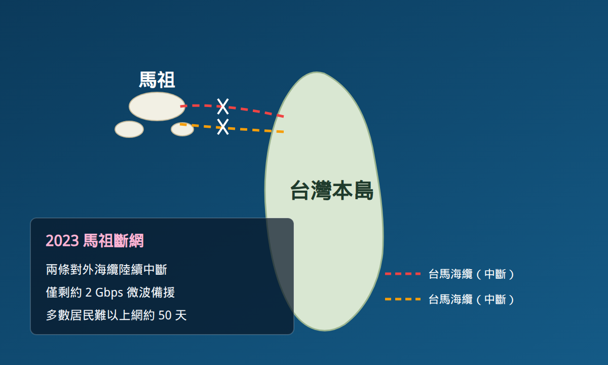
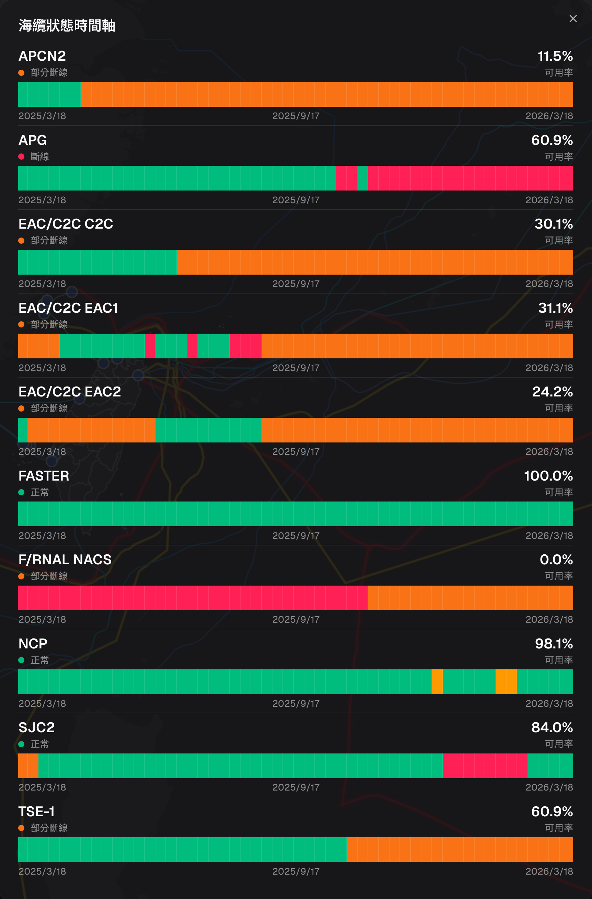
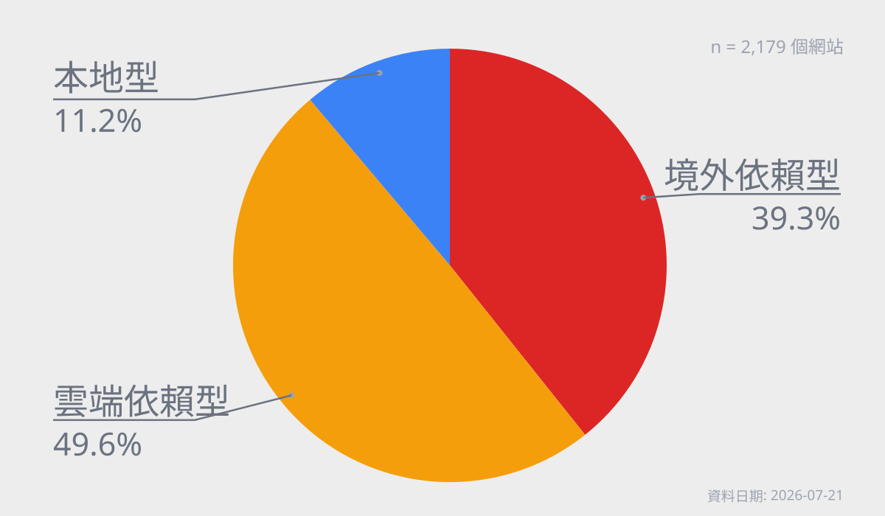

<!-- _class: invert lead-slide -->

# 為什麼政府要即時公開海纜障礙？

- 障礙發生時間
- 替代路由
- 預計修復時間

1 分 15 秒

<!--
我們現在可以上網看到哪些海纜出了狀況、如何改道、預計何時修復。但政府為什麼要把這些資訊公開到這個程度？

這張先提出問題，不急著回答。

要理解這張表的意義，得先看看海纜中斷對人造成過什麼影響。
-->

---

<!-- _class: invert matsu-slide -->

## 馬祖斷網：公民與社會的警醒

- **2023**：兩條對外海纜陸續中斷
- 備援僅約 **2 Gbps** 微波
- 居民通訊與上網長期受限
- 風險從抽象變成日常經驗
- 社會開始追問：我們準備好了嗎？

1 分 30 秒

<!--
馬祖讓公民、技術社群與政府開始更具體地思考：若連線受損，哪些資訊需要事先掌握？

可是，要討論如何準備，第一步就得先看清楚海纜目前的狀態。
-->

---

## 先理解現況：社群做出即時海纜地圖

- 相關資訊原本分散、不易理解
- g0v 韌性松匯集公開與民間資訊
- 製成可持續查看的海纜動態地圖
- 把抽象風險變成可共同討論的現況

[`smc.peering.tw`](https://smc.peering.tw/)

2 分鐘

<!--
科技社群討論如何因應海纜風險時，發現相關資料分散、一般人不容易掌握全貌。

g0v 成員於數位韌性松匯集公開與民間資訊，製作可持續查看的海纜動態地圖。地圖把抽象的海纜風險，變成社會能共同查看、討論的資訊。

知道哪條海纜有狀況後，我還想知道另一件事——如果國際連線真的嚴重受損，我們每天使用的網站會怎麼樣？
-->

---

<!-- _class: invert result-slide -->

## 如果失去國際連線，哪些服務會受影響？

假設南北主要海纜同時受損：

| 類型 | 比例 |
|------|-----:|
| 境外依賴型 | 39.3% |
| 雲端依賴型 | 49.6% |
| 本地型 | 11.2% |

**88.8%** 需進一步關注

首頁資源依賴測量（n = 2,179）  
不代表屆時一定故障

感謝 APNIC Foundation／ISIF Asia 支持

3 分 15 秒

<!--
這是研究情境，不是已發生的事件：假設南北主要海纜因地震等事故同時受損，國際連線嚴重受限，網站能否繼續提供服務？

2026 年 7 月 21 日彙整的資料中，完成了 2,179 個網站的測量。

最值得帶走的數字是：88.8% 落在需要進一步關注的高風險或高不確定性類型。

但這是網站首頁資源依賴的測量，不代表 88.8% 的網站屆時一定會故障；本地型也不保證整個服務能持續運作。

把可能的後果說清楚之後，我們就能回頭看：公開資訊如何改變政府與社會的對話？
-->

---

<!-- _class: invert closing-slide -->

## 公開資訊，推動政府透明與社會韌性

- **Charles Mok**：公開障礙細節有助減少錯誤訊息、建立信心
  - [charlesmok.substack.com](https://charlesmok.substack.com/p/taiwan-is-a-shining-example-of-undersea)
- **Global Taiwan Institute**：民間地圖促使政府公開障礙狀態
  - [globaltaiwan.org](https://globaltaiwan.org/2026/05/trust-as-infrastructure/)
- **Taipei Times／MODA**：以透明與增進公眾理解為公開目標
  - [taipeitimes.com](https://www.taipeitimes.com/News/taiwan/archives/2026/03/19/2003854094)

2 分鐘

<!--
回到第一張的問題：政府為什麼要公開？

民間先把資訊整理出來，也把大眾的疑問具體化；政府則以可持續查詢的資料回應。公開問題與可能後果，有助於減少資訊空白造成的猜測，讓韌性建設建立在共同理解上。

請注意：本研究完成時間晚於 MODA 開始公開障礙資訊的時間，因此不是「這項研究促成了 MODA 的表格」。結論是：公開資訊，讓風險可以被共同面對。
-->
