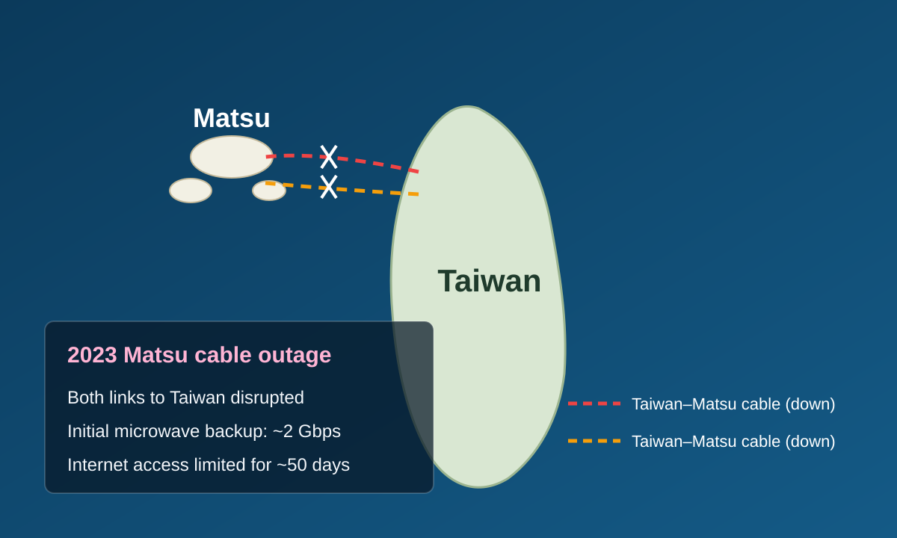

<!-- _class: invert lead-slide -->

# Why Does Taiwan Publish Cable Status?

- Which cables are damaged
- Alternative routes
- Expected repair dates

<a href="https://moda.gov.tw/major-policies/subseacable/fault/1749">MODA disruption table</a> (Chinese original) Table dated 3 Oct 2026

<!--
Time: 1:15 (75 seconds).

Hello everyone. I am Irvin Chen from the Open Culture Foundation and the MozTW community.

Today I want to start with a simple question: why does Taiwan's government publish cable status?

This table is from the Ministry of Digital Affairs, or MODA. It shows which cables are damaged, when the problems started, and when repairs are expected. It also shows the alternative routes used to keep traffic moving.

The page is in Chinese, but anyone can open it and check these details. Taiwan is one of the few countries that publishes cable status in this way.

So why did the government decide to do this?

We will come back to this table. First, let us look at what happened in Matsu.

Sources (reference only, not spoken):
MODA, cable disruption status page. The screenshot shows a table dated 3 Oct 2026.
https://moda.gov.tw/major-policies/subseacable/fault/1749
Taipei Times, "Broadcasting cable status beneficial, MODA says," 19 Mar 2026. Supports "one of the few countries" and the stated purpose of disclosure.
https://www.taipeitimes.com/News/taiwan/archives/2026/03/19/2003854094
-->

---

<!-- _class: invert matsu-slide -->

## When Both Cables Failed

- **Matsu, 2023:** both cables failed
- About **2 Gbps** of initial microwave backup
- Internet access disrupted for about **50 days**
- Can people still use the services they need?

Schematic only. Cable routes are illustrative.

<!--
Time: 1:30 (90 seconds).

Matsu is a group of Taiwanese islands near the coast of China. Two submarine cables connected Matsu to Taiwan.

In February 2023, both cables failed within a week.

There was microwave backup, but the initial capacity was only about two gigabits per second. Much of it had to support essential communications. It was not enough for people's normal Internet use.

One cable was repaired in late March. Residents had spent about fifty days with seriously disrupted Internet access.

We often talk about how many cables are broken and how fast they can be repaired. These questions matter. For users, the question is more direct: can I still use the services I need?

Matsu showed how cable failures can affect daily life for weeks. It gave people a reason to ask what we should prepare before the next outage.

This brings us to the next problem: what information do we have, and can people actually understand it?

Sources (reference only, not spoken):
Chunghwa Telecom, announcement on cable repairs and fee reductions, 16 Feb 2023. Reports initial microwave capacity of 2.2 Gbps and planned expansion. The slide rounds this to about 2 Gbps.
https://www.cht.com.tw/zh-tw/home/cht/messages/2023/0216-1600
The Reporter, report on Taiwan's response to damaged submarine cables, 12 Feb 2025. Describes approximately 50 days of disruption in Matsu in 2023.
https://www.twreporter.org/a/damaged-undersea-cables-raises-alarm-in-taiwan
Image: English adaptation of the deck's existing Matsu schematic. It does not represent actual cable routes.
-->

---

<!-- _class: invert map-slide -->

## Making Cable Status Visible

- Public information was scattered
- g0v Digital Resilience Hackathon
- Cable locations and faults in one map
- Information people can check and discuss

<a href="https://smc.peering.tw/">smc.peering.tw</a> Original interface, captured 14 Jan 2026

<!--
Time: 2:00 (120 seconds).

The technical community started discussing how we should prepare. To do that, we first needed to understand the current situation.

Which cables are working? Which ones are damaged? Where can we find the latest information?

Some information was public, but it was spread across different sources. It was hard for most people to get the full picture.

Members of g0v, Taiwan's civic tech community, brought this information together at digital resilience hackathons. The result was this public submarine cable map. You can find it at smc dot peering dot tw.

This map shows the cables around Taiwan. The reports on the right describe individual faults. People can open the map, check the reports, and follow changes over time.

Most of the time, a cable failure does not disconnect Taiwan because traffic can be rerouted. The details help us understand how much connectivity remains and what needs repair.

Open information gives people something they can check. It also gives the community and government specific questions to discuss.

For me, this led to another question: if several major cables fail at the same time, what still works?

Sources (reference only, not spoken):
Taiwan Submarine Cable Map: https://smc.peering.tw/
The timestamp visible in the supplied screenshot is 14 Jan 2026. This is an interface example, not a current status report.
g0v Digital Resilience Hackathon: https://g0v.hackmd.io/@paulpengtw/DigiResiTh0n-home
Alternative routing and the distinction between partial cable damage and overall connectivity: Taipei Times, 19 Mar 2026.
https://www.taipeitimes.com/News/taiwan/archives/2026/03/19/2003854094
-->

---

<!-- _class: invert result-slide -->

## What Still Works?

If major cables fail in both northern and southern Taiwan:

89% of tested sites need attention

- Foreign-dependent: resources abroad
- Cloud-dependent: local cloud nodes

Homepage test: 2,179 sites, 21 July 2026 Full services still need outage tests

Supported by APNIC Foundation through ISIF Asia

<!--
Time: 3:15 (195 seconds).

This is the question behind my research. Suppose earthquakes damage major cables in both northern and southern Taiwan. International connectivity becomes severely reduced, or stops working. Can people still open the websites and services they need?

We tested websites commonly used in Taiwan. This includes global platforms, news, public services, and community sites that people in Taiwan often use.

For each site, we open the homepage in a browser and record the resources loaded by that page. We then check where those resources are served from and which providers operate them.

We successfully measured 2,179 websites on July 21, 2026. The headline result is this: 88.8 percent, or about 89 percent, need attention.

39.3 percent are foreign-dependent. They load at least one resource from outside Taiwan.

49.6 percent are cloud-dependent. The observed resources are served from Taiwan, but they rely on local nodes of multinational cloud providers or content delivery networks.

Local nodes are valuable. They keep resources close to users. But we still need to know whether they can keep running when international connectivity is lost. They may need overseas systems for authentication, management, or content.

Only 11.2 percent are locally-contained. This means that all observed homepage resources appear local and do not use those multinational cloud nodes.

The database may still be outside Taiwan. Login, payment, search, and forms may use other services that we do not see when we open the homepage.

So this is an initial risk map. It does not mean that all these websites will fail. It means we should test them before a real outage, including the functions people actually use.

I want to thank the APNIC Foundation for supporting this work through ISIF Asia.

The results help us see what needs further work. Now, let us return to the question we started with: why should this information be public?

Sources (reference only, not spoken):
This repository's report/index.md and report/en.md, "When Submarine Cables Go Dark: Understanding and Preparing for the Risks of Taiwan's International Internet Disconnection," results and limitations sections.
Chart: overall-result.en.svg, using the 21 July 2026 data snapshot. The slide rounds the combined 88.8% to 89%, as in the earlier research deck. The combined share is calculated from site counts before rounding individual category percentages.
Research report: https://resilience.ocf.tw/web/report/
Funding: https://apnic.foundation/home/isifasia/
-->

---

<!-- _class: invert closing-slide -->

## Open Information Helps Us Prepare

- **[Charles Mok](https://charlesmok.substack.com/p/taiwan-is-a-shining-example-of-undersea)**: Information gaps let rumors spread.
- **[Liu I-chen / GTI](https://globaltaiwan.org/2026/05/trust-as-infrastructure/)** credits the civic map with pushing government disclosure.
- **[MODA in Taipei Times](https://www.taipeitimes.com/News/taiwan/archives/2026/03/19/2003854094)**: Public information helps people understand cable status.

Our goal is to make the risks clear enough that we can prepare for them.

<!--
Time: 2:00 (120 seconds).

Now we are back at the MODA table.

We have seen what a cable outage can do to daily life. We have also seen how the community collects information and studies the services that people use.

What happens when this information becomes public?

Charles Mok points out that information gaps allow rumors to spread. He suggests that the cable-cut rumors in 2025 pushed the government to publish more details.

Liu I-chen, writing for the Global Taiwan Institute, credits the civic map with pushing government agencies to disclose cable status. That is the author's analysis of the community's influence.

MODA's own explanation, in the Taipei Times interview, is direct: public information helps people understand what is happening.

MODA launched its public status system in September 2025. My research in 2026 continues this work by asking what happens to the services people need.

Open information gives people specific questions to ask. Government can respond with facts about damage, alternative routes, and repair dates.

People can see what is known and what still needs work. This leaves less room for rumors and gives us a better basis for deciding what to prepare.

Our goal is to make the risks clear enough that we can prepare for them.

Sources (reference only, not spoken):
Charles Mok, "Taiwan is a Shining Example of Undersea Cable Incidents Transparency," 10 Jan 2026.
https://charlesmok.substack.com/p/taiwan-is-a-shining-example-of-undersea
Liu I-chen, Global Taiwan Institute, "Trust as Infrastructure: How Transparency Can Save Taiwan's Digital Lifeline," 6 May 2026. Its claim about the civic map influencing government disclosure cites Charles Mok's article.
https://globaltaiwan.org/2026/05/trust-as-infrastructure/
Chiu Chiao-jen and Shelley Shan, Taipei Times, "Broadcasting cable status beneficial, MODA says," 19 Mar 2026. Reports MODA's stated objectives and the September 2025 launch date.
https://www.taipeitimes.com/News/taiwan/archives/2026/03/19/2003854094
Image: MODA cable disruption status page. The table is dated 3 Oct 2026.
https://moda.gov.tw/major-policies/subseacable/fault/1749
-->
