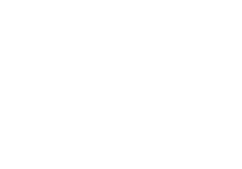
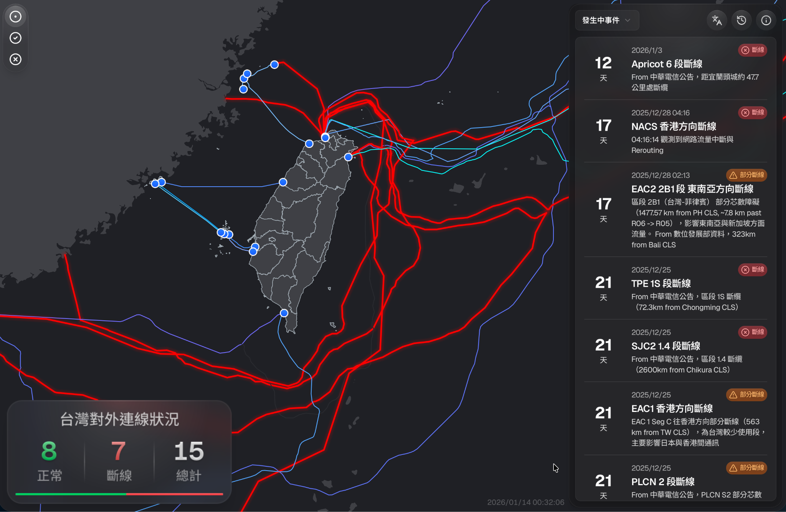

# When Submarine Cables Go Dark

## Understanding Taiwan's digital service resilience

Irvin Chen  
ORCID: [https://orcid.org/0009-0002-1059-7130](https://orcid.org/0009-0002-1059-7130)  
Open Culture Foundation  

Report: [`resilience.ocf.tw/web/report`](https://resilience.ocf.tw/web/report/) →

<!--
Hello everyone. I am Irvin Chen from the Open Culture Foundation and the MozTW community.

Today I want to start with a simple question: if Taiwan loses its submarine cables, what still works?

We often talk about cables as infrastructure: how many cables Taiwan has, how many are broken, and how fast they can be repaired. These questions matter. But for users, the question is more direct: can I still open the websites and services I need?

The full report is online at resilience dot ocf dot tw slash web slash report.

-->

---

## Acknowledgments

This work was supported by a grant from the [APNIC Foundation](https://apnic.foundation/) ([ROR: 01y4y6h16](https://ror.org/01y4y6h16)), via the [Information Society Innovation Fund (ISIF Asia)](https://apnic.foundation/home/isifasia/).

<!--
Before the results, I want to thank the APNIC Foundation and the ISIF Asia Fund for supporting this work.

-->

---

## Cables Are Already Failing

More than **99%** of Taiwan's external traffic depends on submarine cables.

At least one cable is often under repair.

<!--
Taiwan is an island society. More than 99 percent of our external traffic depends on submarine cables.

This chart shows the cable status over the past year.

Cable failures are not rare. Taiwan is often in a state where at least one cable is under repair.

Most of the time, users do not notice, because traffic can be rerouted. The real risk is clustered failure. If several cables fail at the same time, redundancy can disappear very quickly.
-->

---

## What Happens If They Go Dark?

<!--
This map shows the cable status in early January, after the earthquakes around December 27, 2025.

At that time, close to half of Taiwan's international cable systems had problems. Full repairs were not completed until mid-May 2026.

So this is not just a theory. When international connectivity is badly reduced, the real question is: which services can people still use?

If emergency information, payment, logistics, communication, or public services fail, a network problem becomes a social resilience problem. That is why we started looking at digital services from the user side.
-->

---

## Test Target

Websites commonly used in Taiwan

- Tranco `.tw` domains, Cloudflare Radar, Ahrefs, SimilarWeb, Semrush
- Civic-tech and community sites

Latest dataset:

- **2,507** unique sites tested
- **2,179** sites completed
- Data as of **2026-07-21**

<!--
We tested websites commonly used in Taiwan. This is not the same as testing only Taiwanese websites.

If people in Taiwan rely on Google, Gmail, social platforms, e-commerce, news, government services, or community sites, they are part of the resilience picture.

In the latest dataset, we tested 2,507 unique sites, and 2,179 tests completed successfully. The data is from July 21.

For now, the unit is the website homepage. It is not a full service test yet, but it gives us a repeatable starting point.
-->

---

## Method

For each site:

1. Open homepage with headless browser
2. Record and clean resource requests
3. Resolve IP, ASN, and location
4. Detect cloud Taiwan nodes with ASN, headers and RTT
5. Classify dependency exposure

<!--
For each site, we open the homepage with a headless browser and record what the page loads.

Then we clean the list, remove ad-related noise, and check the IP, ASN, and location of each resource.

For major clouds and CDNs, we also use headers and response time to infer whether a resource is served from a Taiwan node.

Finally, we classify the site by the risks we can observe from the homepage.
-->

---

## Overall Result: **88.8%** Need Attention

| Category          | Sites  | Share |
|-------------------|-------:|------:|
| Foreign-dependent |    856 | 39.3% |
| Cloud-dependent   |  1,080 | 49.6% |
| Locally-contained |    243 | 11.2% |

<!--
The headline result is this: 88.8 percent of tested sites need attention.

39.3 percent are foreign-dependent. They load at least one resource from outside Taiwan.

49.6 percent are cloud-dependent. They look local in the beginning, but they rely on Taiwan nodes of multi-national cloud providers.

This does not mean they will all fail. It means we should verify them before a real outage.
-->

---

## 11.2% !== Safe

This is a **risk map**, not a live outage simulation.

Even if the homepage looks local -

- Databases and backend APIs
- Login, payment, search, and forms
- Mobile app traffic
- Cloud control planes and authentication
- Actual routing paths

<!--
Only 11.2 percent look locally contained from the homepage. But they also need care.

If a homepage loads all observed resources from Taiwan, that does not prove the whole service is local.

The database may be outside Taiwan. The API may be outside Taiwan. Login, payment, search, forms, and mobile apps may use different paths.

So this is a risk map. It is not a live outage simulation, and it is not a final pass.
-->
---

## 49.6% Cloud-dependent sites

Can they keep serving when connectivity is isolated?

| Provider Taiwan nodes | Sites |
|-----------------------|------:|
| Google                |   965 |
| Cloudflare            |   480 |
| AWS                   |   138 |
| Akamai                |   104 |

<!--
The cloud-dependent group is especially important.

These sites do not request foreign resources in our homepage test, but many of them still use Taiwan nodes from Google, Cloudflare, AWS, Akamai, and other providers.

Local cloud nodes are useful. They reduce latency and keep materials close to users.

But a local node does not always mean the service can run on its own. During an international outage, the result may depend on cache, origin servers, control planes, login systems, certificates, and provider plans.

So the real question is: can these seemingly localized services keep running when Taiwan is isolated?
-->

---

## Cloud Resource Exposure

<!-- _class: invert tables-slide -->

| Sites                      | Domestic | Foreign |  Total |
| -------------------------- | -------: | ------: | -----: |
| Multinational public cloud |    1,881 |     754 |  1,910 |
| Non-cloud                  |    1,623 |     245 |  1,709 |
| Total                      |    2,140 |     856 |        |

| Provider   | Domestic nodes | Foreign nodes |
| ---------- | -------------: | ------------: |
| Google     |          1,685 |            56 |
| Cloudflare |          1,016 |            17 |
| Amazon     |            512 |           309 |
| Akamai     |            338 |            11 |
| Fastly     |              6 |           257 |
| Microsoft  |            140 |            77 |

- 87.7% use multinational public cloud resources
- Only 1.8% use foreign resources exclusively
- Provider behavior differs substantially

<!--
This table shows two important points.

First, localization already helps. Only 1.8 percent of sites use foreign resources exclusively. Many websites, including foreign services, already serve many resources from Taiwan.

Second, provider behavior is very different. Some providers serve most observed resources from Taiwan nodes. Others have a much more mixed pattern.

So the answer is not simply "avoid cloud" or "host everything locally." CDNs and local cloud nodes can improve resilience, but we need to test how each provider behaves during isolation.
-->

---

## Resource Distribution

Resource dependency is **highly concentrated**.

<!--
Now we look at all resources loaded by the tested website homepages.

When we group them by ASN, the pattern is very concentrated. A small number of providers account for a large share of the observed resources.

This is how the modern web works. It is not evenly spread across many operators. It depends heavily on a few infrastructure and platform providers.

That can help if those providers localize resources well. But it also means resilience depends on a small number of third-party systems.
-->

---

## Public Sector

Foreign dependency is lower in government and education sites.

| Type | Sites tested | Foreign dependencies | Share |
| --- | ---: | ---: | ---: |
| Government | 235 | 16 | 6.8% |
| Education | 255 | 34 | 13.3% |
| All sites | 2,179 | 856 | 39.3% |

<!--
There is one positive finding.

Government and education sites have lower foreign dependency than the overall dataset.

Only 6.8 percent of government sites had observed foreign dependency, compared with 39.3 percent overall. Education sites were also below the average.

This does not prove they are fully safe. But it suggests a better starting point in public-sector and academic-network environments.
-->

---

## Policy Recommendations

- Continuously monitor critical and commonly used services
- Validate major cloud Taiwan-node outage behavior
- Reduce foreign-resource dependency in critical services
- Require backup plans and disconnection exercises
- Define resilience tiers for procurement
- Plan bandwidth priority before the emergency

<!--
For policy, I want to highlight three directions.

First, monitor critical and commonly used services continuously. We need both the big picture and per-service indicators.

Second, test major cloud Taiwan nodes before an outage. Many services depend on them, and we need the providers to help find out what happens when Taiwan is isolated.

Third, reduce foreign-resource dependency in critical services, and require backup plans and disconnection exercises.

We also need pro-cure-ment rules and bandwidth priority plans before an emergency, because it will be too late to recover if we do not already have backups in place.
-->

---

## For Developers

- Plan for external connectivity failures
- Prefer CDNs with Taiwan-based nodes
- Add local fallbacks for critical libraries
- Localize data for critical paths: login, checkout

<!--
Developers can also act on this.

When you build a website, think about what happens if external connectivity fails.

If you use CDN libraries, prefer services with Taiwan-based nodes, and add local fallbacks for critical files.

For important service paths, such as login and checkout, consider where the data and APIs are located.

If you work on cloud services or infrastructure, this is also a design question worth working on.
-->

---

## Potential Follow-up Research

- Fault injection for foreign-resource failure
- Journey tests: login, transactions, browsing, search
- Cloud resilience: control planes, origins, cache, auth
- Traceroute, library, sector, and resource-type analysis
- Identify high-traffic, low-resilience sites & resources

## What about apps?

- OCF is developing a mobile app testing service

<!--
This study is a first structural map. The next step is to test behavior more directly.

We can run fault injection and block foreign resources. We can test real user journeys, such as login, transactions, browsing, and search.

We also need deeper cloud resilience tests: control planes, origins, cache, authentication.

And of course, many people use mobile apps more than websites. OCF is developing a mobile app testing service. Stay tuned later this year.
-->

---

## Participating

Check your website at [`resilience.ocf.tw`](https://resilience.ocf.tw/) →

- g0v Digital Resilience Hackathon  

- Meet us at APAN62 on Aug 12 in Auckland

## Channels *海纜又被鯊魚咬斷了*

- Telegram: [`t.me/s/smc_resilience`](https://t.me/s/smc_resilience)
- Fediverse: [`g0v.social/@smc_resilience`](https://g0v.social/@smc_resilience)
- FB . IG . Threads: [`@smc.resilience`](https://facebook.com/smc.resilience)

## Contact

`t.me/irvin` . `irvin @ moztw.org` . `@irvin`

<!--
The results are published at resilience dot ocf dot tw. You can look up your sites, read the report, and fork the source code.

Our goal is to make resilience visible enough that we can improve it.

This work started from g0v digital resilience hackathons, and we will continue the follow-up work there.

We will also be at APAN62 in Auckland in August. If you will be there, please come talk to us.

Please follow our channels for project updates and Taiwan submarine cable news.

And please stay for the next cable resilience panel. I will now hand over the stage to LuLu and our friends from CRC lab.
-->
